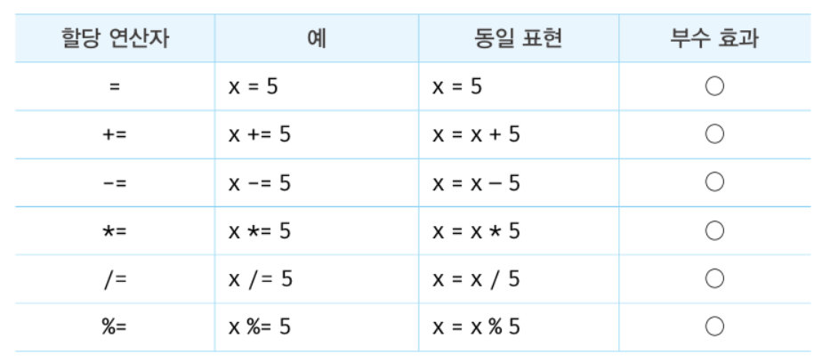
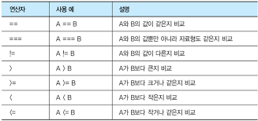
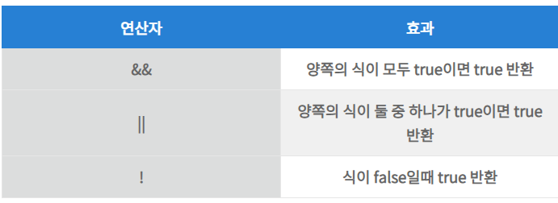
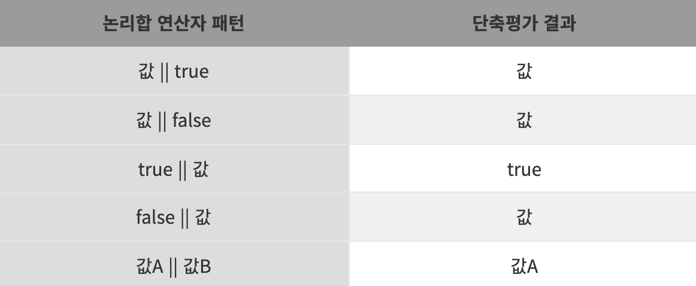
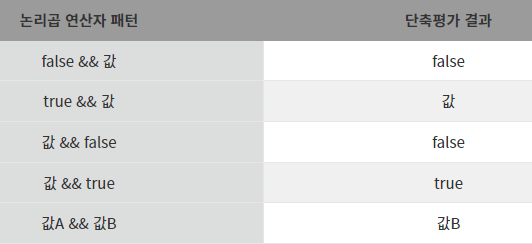

# 6. 데이터 타입

자바스크립트의 모든 값은 데이터타입을 갖는다. 자바스크립트에서는 7개의 데이터타입을 제공합니다.
`원시타입` 과 `객체타입` 으로 나뉜다.


예를 들면, number 타입 1 과 string '1'은 비슷해보이지만 다른 값이다.
숫자 타입 1과 문자열 타입 1은 값을 생성한 목적과 용도가 다르다.
이처럼 개발자는 명확한 의도를 가지고 타입을 구별해서 값을 생성할 것이고, 자바스크립트 엔진은 타입을 구별해서 값을 취급할 것이다.

## 숫자 타입

다른 언어들은 int, long, float, double 같은 숫자타입을 사용하지만, 자바스크립트에선 하나의 타입만 존재한다.
즉, 모든 수를 실수로 처리하고 정수만 표현하기에 별도의 데이터 타입은 존재하지 않는다.

```js
let interger = 10; // 정수
let double = 10.12; // 실수
let negative = -20; // 음의 정수
```

자바스크립트의 숫자 탕닙은 정수만을 위한 타입은 없고 모든 수를 실수로 처리한다. 이는 정수로 표기된다 해도 사실은 실수라는걸 의미한다.
따라서 정수로 표시되는 수끼리 나누더라도 실수가 나올 수 있다.

숫자 타입은 추가적으로 세 가지의 특별한 값을 표현한다.

```js
console.log(10 / 0); // - Infinity : 양의 무한대
console.log(10 / -0); // - -Infinity : 음의 무한대
console.log(1 * "String"); // - NaN : 산술 연산 불가
```

## 문자열 타입

문자열타입은 '', "", `` 을 텍스트를 감싼다. 자바스크립트에서 가장 일반적으로 사용되는 문자열은 ''

### 템플릿 리터럴

ES6부터 템플릿 리터럴 이라는 새로운 문자열 표기법이 도입되었다. 일반적으로 `` 을 사용한다.

### 멀티라인 문자열

- 일반 문자열 내에서 줄바꿈(개행)은 허용되지 않는다.

```js
let str = 'hello
world.'

SyntaxError 가 나온다.
```

줄바꿈을 해야할 시에 `이스케이프 시퀀스` 를 사용한다.


### 표현식 삽입

문자열은 문자열 연산자 + 를 사용해 연결이 가능하다.

표현식을 삽입하려면 `${}` 으로 표현식을 감싸면 된다.

```js
let first = "sy";
let last = "Jeon";

console.log("My name is" + ${first} ${last}.);
```

표현식 삽입은 반드시 템플릿 리터럴 내에서만 사용을 해야한다. 즉 `` 안에서만 사용을 해야한다.
아닐시에 '' , "" 을 사용하면 문자열 취급을 한다.

## 불리언 타입

불리언의 타입의 값은 논리적 참 , 거짓을 나타내는 true, false 뿐이다.

## undefined 타입

undefined 의 값은 undefined 가 유일하다.

변수 선언에 의해 확보된 메모리 공간을 처음 할당이 이뤄질 때까지 빈상일 경우 자바스크립트 엔진이 undefined로 초기화한다.
따라서 변수를 선언한 이후 값을 할당하지 않으면 undefined가 나온다.

자바스크립트 엔진이 변수를 초기화하는 데 사용하는 undefined를 개발자가 의도적으로 변수를 할당한다면 undefined의 본래 취지에 어긋나고 혼란을 줄 수 있으니 undefined 사용은 권장하지 않는다.
그렇다면 변수에 값이 없다는걸 알려주려면 어떻게 해야하는가 ??
간단하다.`null` 을 사용하면 된다.

## null 타입

null 의 값은 null 가 유일하다.
자바스크립트는 대소문자 구분이 가능하니 유의해야한다.

## symbol 타입

ES6에서 추가된 7번째 타입으로 변경 불가능한 원시타입이다.
심볼 값은 다른 값과 중복되지 않는 유일한 값이다.

## 객체 타입

자바스크립트는 객체 기반의 언어이며, `자바스크립트를 이루고 있는 거의 모든 것이 객체`

## 데이터 타입의 중요성

데이터 타입이 필요한 이유

- 값을 저장할 때 확보해야 하는 메모리 공간의 크기를 결정하기 위해
- 값을 참조할 때 한번에 읽어 들여야 할 메모리 공간의 크기를 결정하기 위해
- 메모리에서 읽어 들인 2진수를 어떻게 해석할지를 결정하기 위해

## 동적 타이핑

자바스크립트는 정적 타입 언와 다르게 벼수를 선언할 때 타입을 선언하지 않는다.
다만 var, let, const 키워드를 사용해 변수를 선언할 뿐이다.

`typeof` 연산자를 사용해 타입 확인이 가능하다

```js
let sy;
console.log(typeof sy); // undefined

sy = 3;
console.log(typeof sy); // number

sy = "hello";
console.log(typeof sy); // string

sy = true;
console.log(typeof sy); // boolean

sy = null;
console.log(typeof sy); // null

sy = Symbol();
console.log(typeof sy); // Symbol;

sy = {};
console.log(typeof sy); // Object

sy = [];
console.log(typeof sy); // Object

sy = function () {};
console.log(typeof sy); // function
```

자바스크립트의 변수는 선언이 아닌 할당에 의해 타입이 결정(타입추론) 된다.
그리고 재할당에 의해 변수의 타입은 언제든지 동적으로 변할 수 있다. 이러한 특징을 `동적 타이핑` 이라 하며 자바스크립트를 정적 타입 언와 구별하기위해 `동적 타입 언어` 라고 한다.

변수는 타입을 가질까 ?? 기본적으로 변수는 타입을 가지지 않는다. 하지만 값은 타입을 가진다. 따라서 현재 변수에 할당되어 있는 값에 의해 변수의 타입이 동적으로 결정된다고 표현하는것이 더 적절하다.
변수의 값에 묶여 있는 값에 대한 별명이기 때문이다.

## 정리

코드는 오해하지 않도록 작성해야 한다. 오해는 커뮤니케이션을 어렵게 하는 대표적인 원인으로 생산성을 떨어트리고 팀의 사기 또한 떨어트린다.
코드는 동작만으로 존재하는 것이 아닌 코드는 개발자를 위한 문서이기도 하다.
따라서 사람이 이해할 수 있는 코드, `즉 가독성이 좋은 코드가 좋은 코드이다`

# 7. 연산자

연산자는 하나 이상의 표현식을 대상으로 산술, 할당, 비교, 논리, 타입, 지수연산 등을 수행하여 하나의 값을 만든다.
이때 연산의 대상을 `피연산자(operand)` 라고 한다.
피연산자는 값으로 평가될 수 있는 표현식이여야하고 피연산자와 연산자의 조합으로 이뤄진 연산자 표현식도 값으로 평가될 수있는 표현이여야 한다.

```js
// 산술연산자
5 + 4; // 9

// 문자열 연결 연산자
"My name is" + "Jeon"; // My name is Jeon

// 할당 연산자
color = "red"; // 'red'

// 논리 연산자
true && false; // false

// 비교 연산자
3 > 5; // false

// 타입 연산자
typeof "Hello"; // String
```

## 산술 연산자

산술 연산자는 피연산자를 대상으로 수학적 계산을 수행해 새로운 숫자 값을 만든다. 산술 연산자가 불가능한 경우 NaN을 반환 한다.

### 이항 산술 연산자

이항 산술 연산자는 2개의 피연산자를 산술 연산하자 값을 만든다.
모든 이항 산술 연산자는 부수효과(side effect) 가 없다.
즉, 어떤 산술 연산잔을 해도 피연산자의 값이 바뀌는 경우는 없고 새로운 값을 만들어 낸다.


### 단항 산술 연산자


주의할 점은 이항 산술 연사자와는 달리 증가/감소(++/--) 연산자는 피연산자의 값을 변경하는 부수효과가 있다는 점이다.

```js
let x = 1;

// ++ 연산자는 피연산자의 값을 변경하는 암묵적 할당이 이뤄진다.
x++; // x = x + 1
console.log(x); // 2

// -- 연산자는 피연산자의 값을 변경하는 암묵적 할당이 이뤄진다.
x--; // x = x - 1
console.log(x); // 1
```

증가/감소(++/--) 연산자는 위치에 의미가 있다.
피연산자 앞에 위치한 전위 증가/감소 연산자는 먼저 피연산자의 값을 증가/감소 시킨 후 다른 연산을 수행한다. `++x, --x`
피연산자 뒤에 위치한 후위 증가/감소 연산자는 먼저 다른 연산을 실행한 후 피연사자의 값을 증가/감소시칸다. `x++, x--`

```js
let x = 5,
  result;

// 선 할당 후 증가
result = x++;
console.log(result, x); // 5 6

// 선 증가 후 할당
result = ++x;
console.log(result, x); // 7 7

// 선 할당 후 감소
result = x--;
console.log(result, x); // 7 6

// 선 감소 후 할당
result = --x;
console.log(result, x); // 5 5

// + 단항 연산자는 어떠한 효고과가 없다. 음수를 양수로 전환 X
+10 + // 10
  -10; // -10

// - 단항 연산자는 부호를 반전환 값을 반환
-(-10); // 10
```

### 문자열 연결 연산자

주목할 것은 개발자와의 의도와는 상관없이 자바스크립트 엔진에 의해 암묵적으로 타입이 자동 변환 되기도 한다는 것이다.
이를 `암묵적 타입 변환` , `타입 강제 변환` 이라고도 한다.

## 할당 연산자



할당연산자는 우항에 있는 피연산자의 평가 결과를 좌항에 있는 변수에 할당한다.

## 비교 연산자, 대소비교 연산자

비교연산자는 좌항과 우항의 피연산자를 비교한 다음 그 결과를 불리언 값으로 반환한다.
비교 연산자는 if문이나 for문과 같은 제어문의 조건식에서 주로 사용한다.


`동등비교연산자(==)` 는 결과를 예측하기 어렵고 실수하기 쉽다.
그렇기에 `일치비교연산자(===)` 를 사용하는걸 권장한다.

일치비교연산자를 사용할때 주의할점은 `NaN` 과 `0` 이다.

- NaN은 자신과 일치하지 않는 유일한 값이다. 그렇기에 조사하려면 빌트인 함수인 `Number.isNaN` 을 사용
- 자바스크립트에서는 양의 0 과 음의 0 이 있는데 이들을 비교한 `true` 가 나온다.

## 삼항 조건 연산자

삼항 조건 연산자는 조건식의 평가 결과에 따라 반환할 값을 결정한다. 부수효과는 없다.

```js
let x = 2;

let result = x % 2 ? "홀수" : "짝수"; // 2 % 2 의 나머지는 0 이므로 0은 falsy한 값이기에 짝수가 출력

console.log(result); // 짝수
```

## 논리 연산자





`논리부정(!)` 은 언제나 불리언 값이 나온다.
