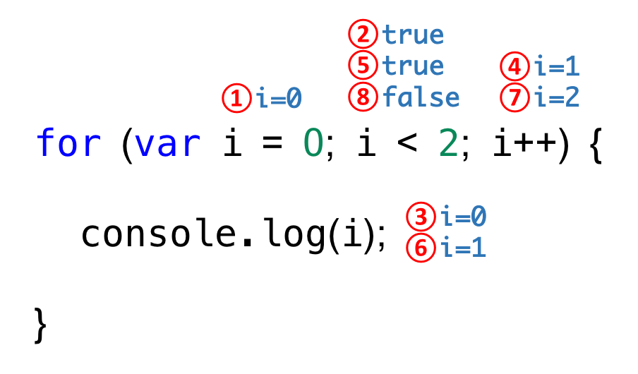

# 8. 제어문

제문은 조건에 따 코 블록을 실행(조건문)하거나 반복 실행(반복문)할 때 사용한다.

## 블록문

블록문은 0개 이상의 문을 중괄호로 묶은 것으로, 코드블록 또는 블록이라고 부르기도 한다.
자바스크립트는 블록문을 하나의 실행 단위로 취급한다.
블록문을 단독으로 사용할 수도 있으나 일반적으로 제어문이나 함수를 정의할 때 사용하는 것이 일반적이다.

문의 끝에는 `;(세미콜론)` 을 붙히는 것이 일반적이지만 블록문은 언제나 문의 종료를 의미하는 자체 종결성을 갖기 때문에 블론문의 끝에는 세미콜론을 붙이지 않는다.

```js
// 블록문
{
  let sy = 10;
}

// 제어문
let sy = 1;
if (sy < 10) {
  sy++;
}

// 함수 선언문
function sum(a, b) {
  return a + b;
}
```

## 조건문

조건문은 주어진 조건식의 평가 결과에 따라 코드 블록의 실행을 결정한다.
조건식은 불리언 값으로 평가될 수 있는 표현식이다 자바스크립트에선 `if...else문`과 `switch문` 두가지를 제공한다.

### if...else

`if...else문`은 주어진 조건식의 평가 , 즉 논리적 참 또는 거짓에 따라 실행할 코드 블록을 결정한다. 조건식의 평가 결과가 `true` 일 경우 if 문의 코드 블록이 실행되고 `false`일 경우 else 문의 코드 블록이 실행된다.

```js
if(조건식) {
// 참일때
} else (조건식) {
// 거짓일때
}
```

조건식을 추가하고 싶을때 `else if 문`을 사용한다.

```js
if(조건식) {
// 참일때
} else if (조건식){
// 조건실행
}  else (조건식){
// 거짓일때
}
```

```txt
else if 문과 else 문은 옵션이다. 즉, 사용할 수도 있고, 사용하지 않을 수도 있다.
if , else 는 한번만 2번이상 사용할 수 없지만 else if 는 여러번 사용이 가능하다.
```

만약 코드 불록내에 문이 하나라면 중괄호를 삭제 할 수 있다.

```js
var num = 2;
var kind;

if (num > 0) kind = "양수";
else if (num < 0) kind = "음수";
else kind = "영";
```

대부분은 if else 문은 `삼항연산자`로 바꿀 수있다.

```js
var num = 2;
var kind;

if (x % 2) {
  result = "홀수";
} else {
  result = "짝수";
}

// 삼항연산자

var result = x % 2 ? "홀수" : "짝수";

// 만약 조건이 세가지 라면 ??

var kind = num > 0 ? ("양수": "음수") : "영";
```

```txt
삼항 조건 연산자는 값으로 평가되는 표현식을 만든다. 따라서 삼항 조건 연산자 표현식은 값처럼 사용할 수 있기 때문에 변수에 할당할 수 있다.
하지만 if else 문은 표현식이 아닌 문이다. 따라서 if...else 문은 값처럼 사용할 수 없기 때문에 변수에 할당할 수 없다.
```

조건에 따라 단순히 변수에 값을 할당할 경우 삼항 조건 연산자가 더 가독성이 좋다. 하지만 조건에 따라 실행해야할 내용이 복잡하여 여러 줄의 문이 필요하다면 if...else 문이 가독성이 좋다.

## 반복문

반복문은 조건식의 평가 결과가 참인 경우 코드 블록을 실행한다. 조건식을 다시 평가하여 여전히 참인 경우 코드 블록을 다시 실행한다. 이는 조건식이 거짓일 때 까지 반복한다.
자바스크립트는 for문 , while문, do...while 문을 제공한다.

### for 문

`for 문은 조건식이 거짓으로 평가될 때 까지 코드블록을 반복 실행한다.`

```js
for(변수 선언문 또는 할당문; 조건식; 증감식){
  조건식이 참인 경우 반복 실행될 문;
}
```

`for문은 매우 중요하다. 많이 연습하고 이해해야한다.`

```js
for (var i = 0; i < 2; i++) {
  console.log(i); // 0 , 1
}
```



for 문 내에 for 문을 중첩해 사용이 가능하다. 이를 중첩 for 문 이라고 한다.

```js
for (var i = 1; i <= 6; i++) {
  for (var j = 1; j <= 6; j++) {
    if (i + j === 6) console.log(`[${i}], ${j}`);
  }
}

// [1, 5], [2, 4], [3, 3], [4, 2], [5, 1]
```
