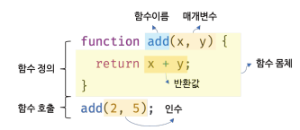
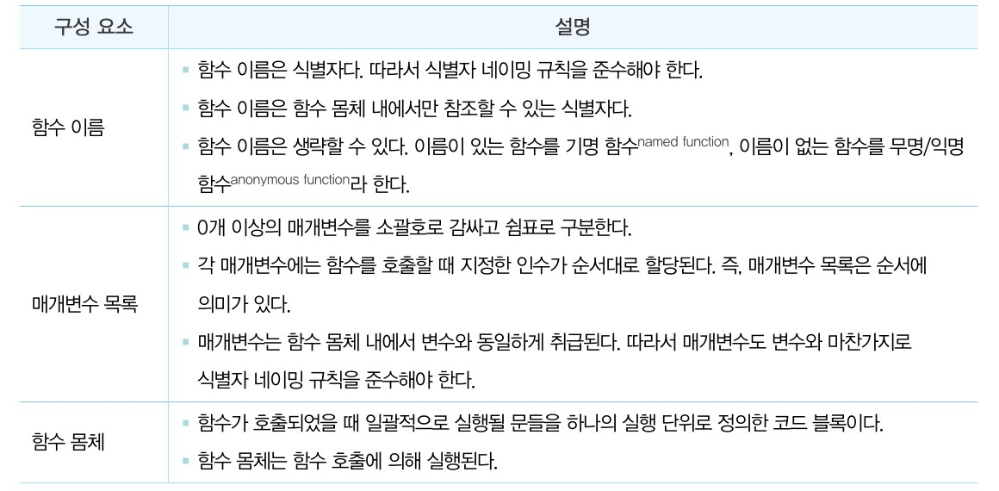
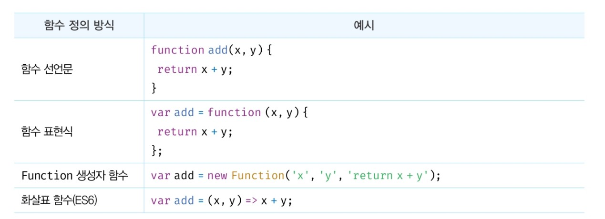
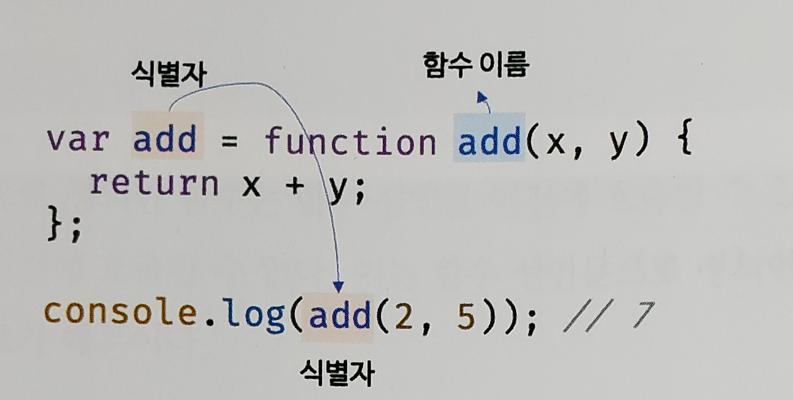

# ⭐️ 11. 원시 값과 객체의 비교 ⭐️

자바크립트는 7가지의 데이터 타입 (number, string, boolean, symbol, undefined, null, object) 크게 `원시타입` 과 `객체타입` 으로 분류 된다.

굳이 구분하는 이유는 뭘까 ? 크게 3가지 이유에서 다르다.

```txt

- 원시 타입의 값, 즉 원시 값은 변경 불가능한 값(immutable value)이고, 객체 타입의 값은 변경 가능한 값(mutable value) 이다.

- 원시 값을 변수에 할당하면 변수(확보된 메모리 공간) 에는 실제 값이 저장되고, 객체를 변수에 할당하면 변수(확보된 메모리공간) 에는 참조 값이 저장된다.

- 원시 값을 갖는 변수를 다른 변수에 할당하면 원본의 원시 값이 복사되어 전달된다. 이를 값에 의한 전달 이라고 한다.

- 객체를 가리키는 변수를 다른 변수에 할당하면 참조 값이 복사되어 전달된다. 이를 참조에 의한 전달 이라고 한다.
```

## 원시 값

원시타입의 값, 즉 원시타입은 변경 불가능한 값이다. 다시 강조하면 한번 생성된 원시 값은 읽기 전용 값으로 변경이 불가능하다.

구체적으로 이야기하면

- 변수는 하나의 값을 저장하기 위해 확보한 메모리 공간 또는 그 메모리 공간을 식별하기 위해 붙인 이름이다.
- 값은 변수에 저장된 데이터로서 표현식이 평가되어 생성된 결과를 말한다.
- 변경 불가능하다는 것은 변수가 아닌 값에 대한 진술이다

결론 : 원시 값은 변경 불가능하다. 라는 말은 원시 값 자체를 변경할 수 없다는 것이지 변수 값을 변경할 수 없다는 것은 아니다.

정리 : 원시 값을 할당한 변수에 새로운 원시 값을 재할당하면 메모리 공간에 저장되어 있는 재할당 이전의 원시 값을 변경하는 것이 아니라 새로운 메모리 공간을 확보하고
재할당한 원시 값을 저장한 후, 변수는 새롭게 재할당한 원시 값을 가리킨다. 이때 변수가 참조하던 메모리 공간의 주소가 바뀐다.

## 객체

객체 타입의 값, 객체는 변경 가능한 값이다.

원시 값을 할당한 변수가 기억하는 메모리 주소를 통해 메모리 공간에 접근하면 원시 값에 접근할 수 있다.
즉, 원시 값을 할당한 변수는 원시 값 자체를 값으로 갖는다. 하지만 객체를 할당한 변수가 기억하는 메모리 주소를 통해 메모리 공간에 접근하면 `참조 값` 에 접근할 수 있다.
참조 값은 생성된 객체가 저장된 메모리 공간의 주소 그 자체이다.

결론 : 원시 값은 불가능한 값이므로 원시 값을 갖는 변수의 값을 변경하려면 재할당 외에는 방법이 없다.
하지만 객체는 변경 가능한 값이다. 따라서 객체를 할당한 변수는 재할당 없이 객체를 직접 변경할 수 있다.
즉, 재할당 벗이 프로퍼티를 동적으로 추가할 수도 있고 프로퍼티 값을 갱신할 수도 있으며 프로퍼티 자체를 삭제할 수도있다.

### 얕은 복사와 깊은 복사⭐️ - 좀 더 정리필요

- 얕은 복사(shallow copy) 주어진 객체의 참조만을 복사하여 새로운 객체를 생성한다. 하위 객체는 참조로 복사되므로 같은 메모리를 가리킨다.
- 깊은 복사(deep copy): 주어진 객체의 모든 내용을 재귀적으로 복사하여 새로운 객체를 생성한다. 모든 하위 객체까지 완전히 분리된 복사본을 만든다.

# 12. 함수

함수는 프로그래밍 언어의일련의 과정을 문 으로 구현하고 코드 블록으로 감싸서 하나의 샐행 단위로 정의한 것

이때 함수 내부로 입력을 전달받는 변수를 `매개변수(parameter)`, 입력을 `인수(argument)`, `반환값(return value)`라고 한다.
함수는 값이며 여러개 존재할 수 있고, `특정 함수를 구별하기 위해 식별자인 함수 이름을 사용 할 수 있다.`


함수는 `함수정의` 를 통해 생성한다. 자바스크립트 함수는 다양한 ㅂ아법으로 정의할 수 있다.

```js
function add(x, y){
  return x + y
}

add(2, 3)

함수 정의만으로 함수가 실행되는건 아니다.
실행해주는걸 `함수 호출` 이라 한다. 함수를 호출하면 코드 블록에 담긴 문들이 일괄적으로 실행되고
반환값을 반환해 준다.
```

## 함수를 사용하는 이유

함수는 필요할 때 여러번 호출할 수 있다.
실행시점을 개발자가 결정할 수 있고, 몇 번이든 재사용이 가능하다.
함수는 몇 번이든 호출할 수 있으므로 `코드의 재사용` 측면에서 아주 좋다.
코드의 중복을 억제하고 재사용성을 높이는 함수는 `유지보수 편의성` 을 높이고 실수를 줄여 `코드의 신뢰성` 을 높이는 효과가 있다.

함수는 객체타입의 값으로 이름(식별자)를 붙일수 있다. 적절한 함수 이름은 함수의 내부 코드를 이해하지 않고도 함수의 역할을 파악할 수 있게 도와주어
`코드의 가독성` 을 향상시킨다.

## 함수 리티럴

함수는 객체 타입의 값이다. 따라서 숫자 값을 숫자 리터럴로 생성하고 객체를 객체 리터럴로 생성하는 것처럼 함수도 함수 리터럴로 생성이 가능하다.

```js
// 변수에 함수 리터럴 할당
let sy = function add(x, y) {
  return x + y;
};
```



## 함수정의



함수를 정의한다는 면에서는 동일하지만 미묘한 중요한 차이가 있다.

`변수는 선언이라고 표현하고 함수는 정의 라고 표현한다.`

### 함수 선언문

```js
function add(x, y) {
  return x + y;
}

console.log(add(2, 3));

// 함수 이름을 생략
function (x,y){
  return x+y
}

// syntaxError
```

함수 선언문은 함수 리터럴과 형태가 동일하다. `단 함수 리터럴은 함수 이름을 생략할 수있지만 함수 선언문은 함수 이름을 생략할 수 없다.`
함수 선언문은 표현식이 아닌 문이다.

따라서 자바스크립트 엔진은 생성된 함수를 호출하기 위해 함수 이름과 동일한 이름의 식별자를 암묵적으로 생성하고 거기에 함수 객체를 할당한다.

```js
let add = function add(x, y) {
  return x + y;
};

console.log(add(2, 3));
```

함수는 함수 이름으로 호출하는 것이 아니라, 함수 객체를 가리키는 식별자로 호출한다. 즉 함수 선언문으로 생성한 함수를 호출한 것은 함수 이름 add가 아니라 자바스크립트 엔진이 암묵적으로 생성한 식별자 add인 것이다.
함수 이름과 변수 이름이 일치하므로 함수 이름으로 호출되는 듯하지만 사실은 식별자로 호출된 것이다.


### 함수표현식

자바스크립트 함수는 계속 말하지만 객체 타입의 값이다.
자바스크립트의 함수는 값처럼 변수에 할당 할 수도 있고 프로퍼티 값이 될 수도 있고 배열의 요소가 될 수도 있다.
이런 값의 성질을 갖는 객체를 `일급객체` 라고 한다.
`자바스크립트는 일급객체 이다.` 일급객체란 함수를 값처럼 자유롭게 사용할 수 있다는 의미이다.

```js
//함수 표현식
let add = function add(x, y) {
  return x + y;
};

console.log(add(2, 3));
```

`함수 선언문은 '표현식이 아닌 문' 이고 함수 표현식은 '표현식인 문' 이다`

### 함수 생성시점과 호이스팅

함수 선언문으로 정의한 함수는 함수 선언문 이전에 호출할 수 있다.
하지만 함수 표현식으로 정의한 함수는 함수 표현식 이전에 호출할 수 없다.
`함수 선언문으로 정의한 함수와 함수 표현식으로 정의한 함수의 생성 시점이 다르기 때문`이다.

코드가 한 줄씩 순차적으로 실행되기 시작하는 런타임에는 이미 함수 객체가 생성되어 있고 함수 이름과 동일한 식별자에
할당까지 완료된 상태다. 따라서 함수 선언문 이전엔 함수를 참조할 수있고 호출할 수도있다.
`함수 선언문이 코드의 선두로 끌어 올려진 것처럼 동작하는 자바스크립트 고유의 특징을 함수 호이스팅` 이라고 한다.
함수 호이스팅과 변수 호이스팅은 차이가 있으니 주의해야한다.

### 화살표함수

화살표 함수는 항상 익명함수로 정의한다.

```js
const add = (x, y) => x + y;
console.log(add(2, 3));
```

### 매개변수의 최대 개수

매겨변수의 최대 개수에 대해 명시적으로 제한하고 있지 않다.
함수의 매개변수는 코드를 이해하는 데 방해되는 요소이므로 이상적인 매개변수 개수는 0개이며 적을수록 좋다.
이상적인 함수는 한가지 일만 해야하며 가급적 작게 만들어야 한다.
따라서 3개 이상을 넘지 않는 것을 권장한다.

## 다양한 함수의 형태

### 즉시 실행 함수(IIFE)

함수 정의와 동시에 즉시 호출되는 함수를 즉시 실행 함수 라고 한다.
즉시 실행 함수는 단 한번만 호출되며 다시 호출할 수 없다.

```js
// 익명 즉시 실행 함수
(function () {
  let a = 3;
  let b = 5;
  return a * b;
})()(
  // 기명 즉시 실행 함수
  (function sy() {
    let a = 3;
    let b = 5;
    return a * b;
  })()
);

sy();
```

즉시 실행 함수는 익명함수를 사용한것이 일반적이다.

### 재귀 함수

함수가 자기 자신을 호출하는 것을 `재귀호출` 이라고 한다. 재귀함수는 자기 자신을 호출하는 행위 즉 재귀호출을 수행하는 함수를 말한다.
재귀 함수는 반복되는 처리를 위해 사용한다.
