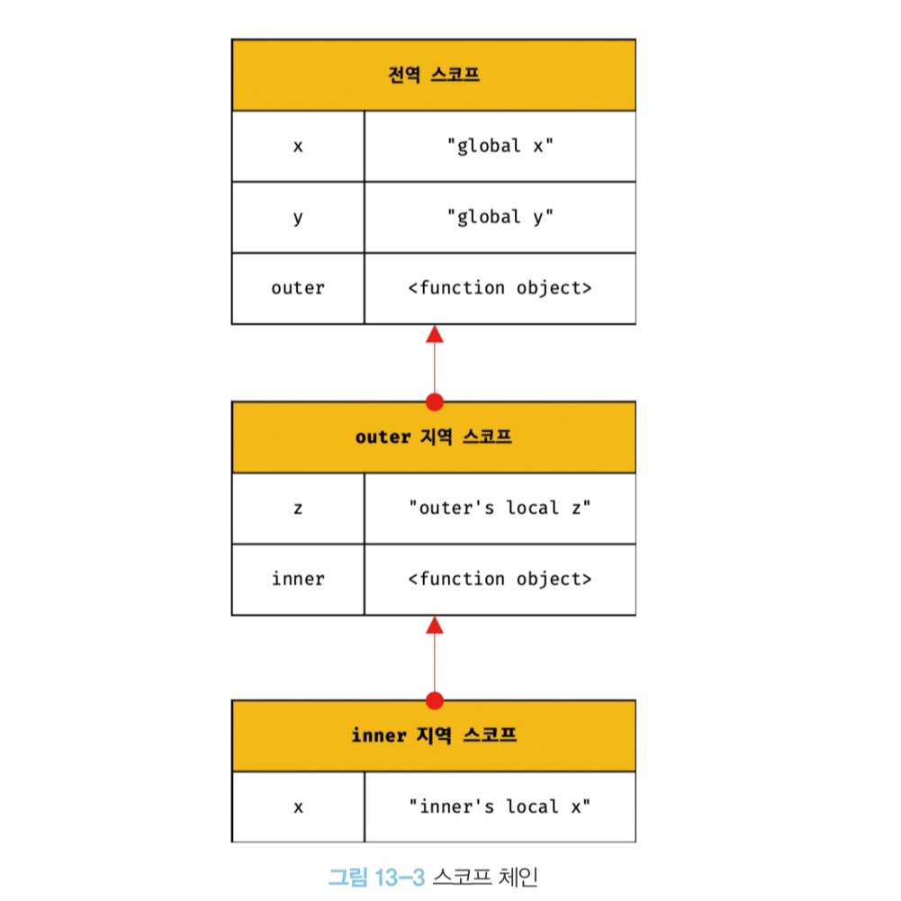

# ⭐️ 스코프 ⭐️

스코프(유효범위)는 자바스크립트를 포함한 모든 프로그래밍 언어의 기본적이며 중요한 개념이다. 이해가 부족하면 다른 개념을 이해하기 어려울 수 있다.
스코프는 변수 그리고 함수와 깊은 관련이 있다.
함수의 매개변수는 함수 몸체 내부에서만 참조함 수 있고 함수 몸체 외부에서는 참조할 수 없다고 했다. 이것은 매개변수를 참조할 수 있는 유효범위, 즉 매개변수의 스코프가 함수 몸체 내부로 한정되기 때문이다.

```js
function add(x, y) {
  // 매개변수는 함수 내부에만 참조 가능
  // 매개변수의 스코프는 함수 내부이다.
  console.log(x, y); // 2,5
  return x + y;
}

add(2, 3);

console.log(2, 3); // ReferenceError
```

변수는 코드의 가장 바깥 영역뿐 아니라 코드 블록이나 함수 몸체 내에서도 선언할 수 있다. 이때 코드 블록이나 함수는 중첩될 수 있다.

```js
var var1 = 1; // 코드의 가장 바깥에서 선언한 변수

if (true) {
  var var2 = 2; // 코드 블록 내에 선언한 변수
  if (true) {
    var var3 = 3; // 중첩된 코드 블록 내에서 선언한 변수
  }
}

function foo() {
  var var4 = 4; // 함수 내에서 선언한 변수

  function bar() {
    var var5 = 5; // 중첩된 함수 내에서 선언한 변수
  }
}

console.log(var1); // 1
console.log(var2); // 2
console.log(var3); // 3
console.log(var4); // ReferenceError
console.log(var5); // ReferenceError
```

모든 식별자(변수 이름, 함수 이름, 클래스 이름 등) 자신이 선언된 위치에 의해 다른 코드가 식별자 자신을 참조할 수 있는 유효범위가 결정된다. 이것을 `스코프` 즉 `스코프` 는 식별자가 유효한 범위라고 한다.

```js
var x = 'sy'

function foo(){
    var x = 'jr'
    console.log(x)  //jr
}

foo()

console.log(x) // sy

바깥에서 선언된 x는 어디서든 참조 가능
함수 안에서 선언된 x는 함수 내에서만 참조 가능
```

자바스크립트 엔진은 이름이 같은 두 개의 변수 중에서 어떤 변수를 참조해야 할 것인지를 결정해야한다. 이를 `식별자 결정` 이라고 한다. 따라서 스코프란 자바스크립트 엔진이 식별자를 검색할 때 사용하는 규칙 이라고도 할 수 있다.
식별자는 어떤 값을 구별할 수 있어야 하므로 유일해야한다. 따라서 식별자인 변수 이름은 중복될 수 없다. 즉, 하나의 값은 유일한 식별자에 연결되어야 한다.

## 스코프의 종류

코드는 전역(global)과 지역(local)으로 구분이 가능하다.


이때 변수는 자신이 선언된 위치에 의해 자신이 유효한 범위인 스코프가 결정된다.
즉, 전역에서 선언된 변수는 전역 스코프를 갖는 전역 변수이고, 지역에서 선언된 변수는 지역 스코프를 갖는 지역 변수이다.


전역이란 코드의 가장 바깥 영역을 말한다. 전역은 `전역 스코프` 를 만든다.
전역에 변수를 선언하면 전역 스코프를 갖는 `전역 변수(global variable)`가 된다. `전역 변수는 어디서든지 참조할 수 있다.`

지역이란 함수 몸체 내부를 말한다. 지역은 `지역 스코프`를 만든다.
지역에 변수를 선언하면 지역 스코프를 갖는 `지역 변수(local variable)`가 된다.
지역 변수는 자신이 선언된 지역과 하위 지역(중첩함수)에서만 참조 할 수있다.
즉, 지역 변수는 자신의 지역 스코프와 하위 지역 스코프에서만 유효하다.

## 스코프 체인

함수의 몸체 내부에서 함수가 정의된 것을 `함수의 중첩` 이라고 한다. 그리고 함수 몸체 내부에서 정의한 함수를 `중첩 함수`, 중첩 함수를 포함하는 함수를 `외부 함수` 라고 한다.
함수는 중첩될 수 있으므로 함수의 지역 스코프도 중첩될 수 있다. 이는 `스코프가 함수의 중첩에 의해 계층적 구조를 갖는다.` 를 의미한다.



모든 스코프는 하나의 계층적 구조로 연결되고, 모든 지역 스코프의 최상위 스코프는 전역 스코프이다. 이렇게 계층적으로 연결된 것을 `스코프 체인` 이라고 한다.
`변수를 참조할 때 자바스크립트 엔진은 스코프 체인을 통해 변수를 참조하는 코드의 스코프에서 시작하여 상위 스코프 방향으로 이동하며 선언된 변수를 검색한다.`

자바스크립트 엔진은 스코프 체인을 따라 변수를 참조하는 코드의 스코프에서 시작해서 상위 스코프 방향으로 이동하며 선언된 변수를 검색한다.
`절대 하위 스코프로 내려가면서 식별자를 검색하는 일은 없다.`
이는 상위 스코프에서 유효한 변수는 하위 스코프에서 자유롭게 참조 할 수 있지만 하위 스코프에서 유효한 변수를 상위 스코프에서 참조할 수 없다는 것을 의미한다.
스코프 체인으로 연결된 스코프의 계층적 구조는 부자 관계로 이뤄진 `상속` 과 유사하다.

## 함수 레벨 스코프

지역은 함수 몸체 내부를 말하고 지역은 지역 스코프를 만든다고 했다. `코드 블록이 아닌 함수에 의해서만 지역 스코프가 생성된다` 라는 의미이다.

## 렉시컬 스코프

```js
var x = 1;

function foo() {
  var x = 10;
  bar();
}

function bar() {
  console.log(x);
}

foo(); // 1
bar(); // 1
```

위 예제로 두가지를 패턴을 볼 수 있다.

- 1. 함수를 어디서 호출 했는지에 따라 함수의 상위 스코프가 결정한다.
- 2. 함수를 어디서 정의 했는지에 따라 함수의 상위 스코프가 결정한다.

첫번째 방식을 `동적스코프(dynamic scope)` 라 한다. 함수를 정의하는 시점에는 함수가 어디서 호출될지 알 수 없다. 따라서 함수가 호출되는 시점에 동적으로 상위 스코프를 결정해야 하기 때문에 동적 스코프라고 부른다.
두번째 방식을 `렉시컬 스코프(lexical scope) 또는 정적스코프(static scope)` 라 한다. 함수 정의가 평가되는 시점에 상위 스코프가 정적으로 결정되기 때문에 정적 스코프라고 부른다. 자바스크립트를 비롯한 대부분의 프로그래밍 언어는 렉시컬 스코프를 따른다.

`자바스크립트는 렉시컬 스코프를 따르므로 함수를 어디서 호출했는지가 아닌 함수를 어디서 정의 했는지에 따라 상위 스코프가 결정된다.` 함수가 호출된 위치는 상위 스코프 결정에 어떠한 영향도 주지 않는다. 즉, 함수의 상위 스코프는 언제 자신이 정의된 스코프다.
이처럼 함수의 상위 스코프는 함수 정의가 실행될 때 정적으로 결정된다. 함수 정의가 실행되어 생성된 함수 객체는 이렇게 결정된 상위 스코프를 기억한다. 함수가 호출될 때마다 함수의 상위 스코프를 참조할 필요가 있기 때문이다.

# 14 전역변수의 문제점

전역 변수의 무분별한 사용은 위험하다. 전역 변수를 반드시 사용해야 할 이유를 찾지 못한다면 지역 변수를 사용해야 한다.

## 변수의 생명 주기

변수는 선언에 의해 생성되고 할당을 통해 값을 갖는다. 그리고 언젠가 소멸한다. 즉 변수는 소멸되는 생명 주기가 있다.
변수는 자신이 선언된 위치에서 생성되고 소멸한다. 전역 변수의 생명 주기는 애플리케이션의 생명 주기와 같다.
하지만, 함수 내부에서 선언된 지역 변수는 함수가 호출되면 생성되고 함수가 종료하면 소멸한다.

```js
function foo() {
  var x = "local";
  console.log(x); // local
  return x;
}

foo;
console.log(x); // ReferenceError
```

변수 선언은 코드가 한 줄씩 순차적으로 실행되는 시점인 런타임에 실행되는 것이 아니라 런타임 이전 단계에서 자바스크립트 엔진에 의해 먼저 실행된다.
`지역 변수의 생명주기는 함수의 생명 주기와 일치한다.`


## 전역 변수의 생명주기

함순와 달리 전역코드는 명시적인 호출 없이 실행된다.
브라우저 환경에서의 전역 객체는 window이므로 var키워드로 선언한 전역 변수는 전역 객체 window의 프로퍼티 이다.
전역객체 window는 웹페이지를 닫기 전까지 유효하다. 즉, 브라우저 환경에서 var 키워드로 선언한 전역변수는 웹페이지를 닫을 때까지 유효하다.
`var 키워드로 선언한 전역 변수의 생명주기는 전역 객체의 생명주기와 일치한다.`


# 15 let , const 키워드와 블록 레벨 스코프

## let 키워드

### 변수 중복 선언 금지

var 키워드로 이름이 동일한 변수를 중복 선언하면 아무런 에러가 발생하지 않는다.
하지만 let 키워드로 이름이 같은 변수를 중복 선언하면 syntaxError가 나온다.

```js
let sy = 10;
let sy = 20;
```

### 블록 레벨 스코프

let 키워드로 선언한 변수는 모든 코드 블록(함수, if문, for문, while문, try/catch문) 을 지역 스코프로 인정하는 블록 레벨 스코프 라고 한다.

```js
let sy = 1 // 전역 변수

{
  let sy = 2 // 지역변수
  let bar = 3 // 지역 변수
}

console.log(sy) // 1
console.log(bar) // ReferenceError

let 키워드로 선언된 변수는 블록 레벨 스코프를 따른다.
```

함수도 코드 블록이므로 스코프를 만든다. 이때 함수 내의 코드 블록은 함수 레벨 스코프에 중첩된다.


### 변수 호이스팅

var 키워드로 선언한 변수와 달리 let 키워드로 선언한 변수는 변수 호이스팅이 발생하지 않는 것처럼 동작한다.
let 키워드로 선언한 변수는 선언단계와 초기화단계가 분리되어 진행된다.
즉, 자바스크립트 엔진에 의해 암묵적으로 선언 다녜가가 먼저 실행되지만, 초기화 단계는 변수 선언문에 도달 했을때 실행된다.
만약 초기화 단계가 실행되기 이전에 변수에 접근하려고 하면 참조 에러가 발생한다.
스코프의 시작 지점부터 초기화 시작 지점까지 변수를 참조할 수없는 구간을 `일시적 사각지대 (Temporal Dead Zone) TDZ 라고 한다.`


### 전역 객체와 let

let 키워드로 선언한 전역 변수는 전역 객체의 프로퍼티가 아니다.
그렇기에 window에 접근이 안된다. let 전역 변수는 보이지 않는 개념적인 블록 내에 존재한다.

```js
let x = 1;

console.log(window.x); // undefined
console.log(x); // 1
```

## const 키워드

1. const 키워드로 선언한 변수는 반드시 선언과 동시에 초기화 되어야 한다.
2. 그렇지 않으면 문법 에러가 나온다.
3. const 키워드로 선언한 변수는 재할당이 금지 된다.

```js
const sy = 1;

const sy; // SyntaxError

sy = 3 // TypeError
```

const 선언한 변수는 let 변수와 같이 블록 레벨 스코프를 가지며 , 변수 호이스팅이 발생하지 않는 것처럼 동작한다.

### 상수

const 키워드로 선언한 변수에 원시 값을 할당한 경우 변수 값을 변경할 수 없다.
변수의 상대 개념인 상수는 재할당이 금지된 변수를 말한다.
상수는 상태 유지와 가독성 , 유지 보수의 편의를 위해 적극적으로 사용해야 한다.

```js
const TAX_RATE = 0.1; // 세율을 의미하는 0.1 은 절대 바뀌지 않는 숫자라고 표기. 바뀌지 않는 const 변수명은 대문자로 하고 여러단어로 이루어진 경우 _ 로 한다.

// 세전 가격
let preTaxPrice = 100;

// 세후 가격
let afterTaxPrice = preTaxPrice + preTaxPrice * TAX_RATE;

console.log(afterTaxPrice); // 110
```

### const 키워드와 객체

const 키워드로 선언된 변수에 원시 값을 할당한 경우 값을 변경할 수 없다. 하지만 const 키워드로 선언된 변수에 객체를 할당한 경우 값을 변경할 수 있다.
변경 불가능한 값인 원시 값은 재할당 없이 변경할 수 있는 방법이 없지만 변경 가능한 값인 객체는 재할당 없이도 직접 변경이 가능하기 때문이다.

```js
const person = {
  name: "Jeon",
};

person.name = "Pyun"; // 객체는 변경 가능한 값 , 즉 재할당 가능

console.log(person); // { name : 'Pyun' }
```

### var vs let vs const

변수 선언에 기본적으로 `const` 를 사용하고 `let`은 재해당이 필요한 경우에 한정해 사용하는 것이 좋다.
const 키워드를 사용하면 의도치 않은 재할당을 방지하기 때문에 좀 더 안전하다.

- ES6를 사용한다면 var를 사용을 금지한다.
- 재할당이 필요한 경우에 let 키워드를 사용 이때 변수의 스코프는 최대한 좁게 만든다.
- 변경이 발생하지 않고 읽기 전용으로 사용하는 원시 값과 객체에는 const를 사용한다.
- const 키워드는 재할당을 금지하므로 var, let 키워드 보다는 안전하다.

변수를 선어하는 시점에는 재할당이 필요할지 모르는 경우가 많다.
그래서 변수를 선언할때는 우선적으로 const를 사용하자.
만약 재할당이 필요하다면 그때가서 const 를 let으로 바꿔도 늦지 않는다.
