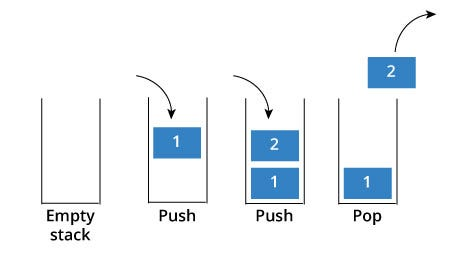
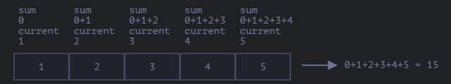

# 배열

## 배열 ??

배열은 여러 개의 값을 순차적으로 나열한 자료 구조이다.
사용 빈도가 높으니 능숙하게 다룰 수 있다면 코딩에 매우 도움이 된다.

```js
const arr = ["apple", "banana", "orange"];
```

가지고 있는 값을 `요소` 라고 부른다. 자바스크립트의 모든 값은 배열의 요소가 될 수 있다. 즉, 원시값은 물론 객체, 함수, 배열 등 자바스크립트에서 값으로 인정하는 모든 것은 배열의 요소가 될 수 있다.

배열의 요소는 배열에서 자신의 위치를 나타내는 0 이상의 정수인 `인덱스(index)`를 가진다. 요소에 접근할때 사용되며 index는 0부터 시작한다.

위의 예시를 토대로 설명하자면 `apple` 은 0 , `banana` 는 1, `orange` 는 2 이다.

요소에 접근하기 위해 `대괄호 표기법[]` 을 사용하고 요소의 index를 불러온다.

```js
arr[0]; // 'apple'
arr[1]; // 'banana'
arr[2]; // 'orange'
```

배열의 요소의 개수 , 즉 배열의 길이를 나타내는 `length` 프로퍼티를 갖는다.

```js
arr.length; // 3
```

배열은 인덱스와 length 프로퍼티를 갖기에 `for문` 을 통해 순차적으로 요소에 접근이 가능하다.

```js
for(let i = 0; i < arr.length; i++;) {
  console.log(arr[i]) // "apple", "banana", "orange"
}
```

배열은 타입이 없다. `object(객체)` 타입이다.
일반 객체와 배열을 구분하는 가장 확실한 차이는 `값의 순서` 그리고 `length 프로퍼티` 이다.
인덱스로 표현되는 값의 순서와 length 프로퍼트를 갖는 배열은 반복문을 통해 순차적으로 값에 접근하기 적합한 구조다.

```js
const arr = [1, 2, 3];

for (let i = 0; arr.length < i; i++) {
  console.log(arr[i]);
}
```

배열의 장점은 처음부터 순차적으로 요소에 접근이 가능하고, 마지막부터 역순으로 요소에 접근할 수도있고, 특정 위치부터 순차적으로 요소에 접근할 수도 있다는 것이고, 배열이 index , 즉 값의 순서와 length 프로퍼티를 갖기 때문에 가능한 것이다.

## 배열 생성

객체와 마찬가지로 배열도 다양한 생성 방식이 있다. 가장 일반적으로 간편한 배열 생성 방식은 `배열 리터럴` 을 사용하는 것이다.
사용방법은 `[]` 를 사용하고 `,` 로 구분한다. 객체와는 달리 프로퍼티 키가 없고 값만 존재한다.

```js
const arr = [1, 2, 3];
console.log(arr.length); // 3

// 요소를 없게 만들면 배열의 길이 즉 length 프로퍼티 값이 0 인 배열이 된다.
const arr2 = [];
console.log(arr.length); // 0

// 희소 배열도 생성 가능.
const arr3 = [1, , 3];
console.log(arr.length); // 3
console.log(arr); // [1, empty, 3]
console.log(arr[1]); // undefined
```

### Array 생성자 함수

Object 생성자 함수를 통해 객체를 생성하듯 Array 생성자 함수를 사용해 배열을 생성할 수 있다.

```js
// 전달된 인수가 1개이고 숫자인 경우 length 프로퍼티 값이 인수인 배열을 생성
const arr = new Array(10);

console.log(arr); // [empty * 10]
console.log(arr.length); // 10

// 최대 4,294,967,295 개 생성 가능
new Array(4294967295);

// 하나라도 많으면 에러 발생
new Array(4294967296); // RangeError

// 음수면 에러 발생
new Array(-1); // RangeError

// 인수가 없는 경우 빈 배열
new Array(); // []
```

## 배열 요소의 참조

참조할땐 `대괄호[] 표기법` 을 사용한다. 대괄호 안에는 index가 와야하고 정수로 평가되는 표현식이라면 index 대신 사용이 가능하다. 값을 참조할 수 있다는 의미에서 객체의 프로퍼티 키와 같은 역할을 한다.

```js
const arr = [1, 2];

console.log(arr[0]); // 1
console.log(arr[1]); // 2

// 존재하지 않는 요소를 넣는다면 undefined를 반환
console.log(arr[2]); // undefined
```

## 배열 요소의 추가와 갱신

객체와 프로퍼티를 동적으로 추가할 수 있는 것처럼 배열에도 요소를 동적으로 추가할 수 있다. 존재하지 않는 index를 사용해 값을 할당하면 새로운 요소가 추가된다. 이때 length 프로퍼티 값은 자동 갱신된다.

```js
const arr = [0];

arr[1] = 1; // 요소 추가

console.log(arr); // [0, 1]
console.log(arr.length); // 2

// 이미 있는 요소에 값을 넣으면 재할당 된다.
arr[1] = 10;
console.log(arr); // [0, 10]
```

정수 이외의 값을 index처럼 사용하면 요소가 생성되는 것이 아닌 프로퍼티가 생성된다. 이때 추가된 프로퍼티는 length 프로퍼티 값에 영향을 주지 않는다.

```js
const arr = [];

// 요소 추가
arr[0] = 1;
arr["1"] = 2;

// 프로퍼티 추가
arr["foo"] = 3;
arr.bar = 4;
arr[1.1] = 5;
arr[-1] = 6;

console.log(arr); // [1, 2, foo:3, bar:4, '1.1' : 5, '-1' : 6]

// 프로퍼티는 length 에 영향을 주지 않는다.
console.log(arr.length); // 2
```

## 배열 요소의 삭제

배열은 객체이기에 배열의 특정 요소 삭제하기 위한 `delete` 연산자가 사용이 가능하다.

```js
const arr = [1, 2, 3];

delete arr[1];
console.log(1, empty, 3);

// 프로퍼티는 length 에 영향을 주지 않는다.
console.log(arr.length); // 3
```

`delete` 연산자는 객체의 프로퍼티를 삭제한다. 프로퍼티 키인 1을 삭제한다. 이때 희소배열이 되므로 length 프로퍼티 값은 변하지 않는다.
따라서 희소배열을 만드는 `delete` 연산자는 사용하지 않는 것이 좋다.

희소 배열을 만들지 않고 특정 요소를 완전히 삭제하려면 `Array.prototype.splice` 메서드를 사용한다.

```js
const arr = [1, 2, 3];

arr.splice(1, 1); // Array.prototype.splice(삭제할 index, 삭제할 요소 수)
console.log(arr); // [1, 3]

console.log(arr.length); // 2  length 프로퍼티가 자동 갱신된다.
```

## 배열 메서드

배열을 다룰때 유용한 다양한 빌트인 메서드를 제공한다.
Array 생성자 함수는 정적 메서드를 제공하며, 배열 객체의 프로토 타입인 Array.prototype 은 프로토타입 메서드를 제공한다. 그렇기에 사용빈도가 높은 자료구조이므로 배열 메서드의 사용법을 잘 알아둬야한다.

배열에는 결과물을 반환하는 패턴이 두 가지이기에 주의가 필요하다.

배열에는 원본 배열(배열메서드를 호출한 배열), 즉 배열 메서드의 구현체 내부에서 this가 가르키는 객체 를 직접 변경하는 메서드와
원본 배열을 직접 변경하지 않고 새로운 배열을 생성하여 반환하는 메서드가 있다.

```js
const arr = [1];

arr.push(2); // push 메서드는 배열(arr) 을 직접 변경
console.log(arr); // [1, 2]

const result = arr.concat(3); // concat 메서드는 원본 배열을 직접 변경하지 않고 새로운 배열을 생성하여 반환
console.log(arr); // [1, 2]
console.log(result); // [1, 2, 3]
```

원본 배열을 직접 변경하는 메서드는 외부상태를 직접 변경하는 부수효과(side effect) 가 있으니 사용할 때 주의해야 한다.
가급적 원본 배열을 직접 변경하지 않는 메서드를 사용하는것이 좋다.

## 사용 빈도가 높은 메서드

### Array.isArray

`Array.isArray` 는 Array 생성자 함수의 정적 메서드 Array.of , Array.from 도 Array 생성자함수의 정적 메서드이다.

Array.isArray 메서드는 전달된 인수가 배열이면 true, 배열이아니면 false 를 반환한다.

```js
// true
Array.isArray([])
Array.isArray([1, 2])
Array.isArray([new Array()])

// false
Array.isArray([])
Array.isArray({})
Array.isArray(null)
Array.isArray(undefined)
Array.isArray(1)
...
```

### Array.prototype.indexOf

`indexOf` 매서드는 원본 배열에서 인수로 전달된 요소를 검색하여 index를 반환

- 원본 배열에 인수로 전달한 요소와 중복되는 요소가 여러 개 있다면 첫 번째로 검색된 요소의 index를 반환
- 원본 배열에 인수로 전달한 요소가 존재하지 않으면 `-1`을 반환

```js
const arr = [1, 2, 2, 3];
arr.indexOf(2); // 1   요소가 여러개 있기에 처음 index 1 을 반환
arr.indexOf(4); // -1  요소가 없기에 index -1을 반환
arr.indexOf(2, 2); // 2  요소가 여러개 일때 확인하는 방법 - 첫번째는 찾을 index 두번째는 몇번째 있는 index = 즉 index 2 를 찾되 2번째 index 2를 찾아라.

// 응용
const foods = ["apple", "banana", "orange"];
if (food.indexOf("orange") === -1) {
  foods.push("orange");
}

console.log(foods); // ["apple", "banana", "orange"];

// ES7 이후 도입된 Array.prototype.includes 메서드 사용
const foods = ["apple", "banana", "orange"];

if (foods.includes("orange")) {
  foods.push("orange");
}
```

### Array.prototype.push

인수로 전달받은 모든 값을 원본 배열의 `마지막 요소`로 추가하고 변경된 length 프로퍼티 값을 반환
push 메서드는 원본 배열을 직접 변경한다.

```js
const arr = [1, 2];

let result = arr.push(3, 4);
console.log(result); // 4

console.log(arr); // [1, 2, 3, 4]
```

push 는 성능면에서 좋지 않다. length 포르퍼티를 사용하여 배열의 마지막에 추가가 가능하다. push 보다 빠르다.

```js
const arr = [1, 2];
arr[arr.length] = 3;
console.log(arr); // [1, 2, 3]
```

push는 원본 배열을 변경하는 부수효과가 있다. 그렇기에 `스프레드 문법`을 사용해주는것이 좋다.
`스프레드 문법` 을 사용하면 호출 없이 마지막에 요소를 추가 할 수 있고 부수효과도 없다.

```js
const arr = [1, 2];
const newArr = [...arr, 3];

console.log(newArr); // [1, 2, 3]
```

### Array.prototype.pop

pop 메서드는 원본 배열에서 마지막 요소를 제거하고 제거한 요소를 반환한다.
원본 배열이 빈 배열이면 undefined를 반환하고 pop 메서드는 원본 배열을 직접 변경한다.

```js
const arr = [1, 2];

let result = arr.pop();
console.log(result); // 2

console.log(arr); // [1]
```

pop 과 push 를 사용하면 스택을 쉽게 구현할 수 있다.

`스택` 은 데이터를 마지막에 밀어 넣고, 마지막에 밀어 넣은 데이터를 꺼내는 `후입선출(LIFO - Last In First Out)` 방식의 자료 구조.
`스택` 은 언제나 가장 마지막에 밀어 넣은 최신 데이터를 먼저 취득하고, 스택에 데이터를 밀어 넣는것을 `push` 라고 하고 스택에서 꺼내는것을 `pop` 라 한다.



함수로 구현해보겠다.

```js

const Stack = (function() {
  function Stack(array = []) {
    if (!Array.isArray(array)) {
      throw new TypeError(`${array} is not an array`)
    }
    this.array = array
  }
  Stack.prototype = {
    constructor : Stack,
    push(value) {
      return this.array.push(value)
    },
    pop() {
      return this.array.pop()
    },
    entries() {
      return(...this.array)
    }
  }
  return Stack
}())

const stack = new Stack([1, 2])
console.log(stack.entries()) // [1, 2]

stack.push(3)
console.log(stack.entries()) // [1, 2, 3]

stack.pop()
console.log(stack.entries()) // [1, 2]
```

### arr.shift() , arr.unshift

두 메서드는 맨 뒤에 요소를 삭제하는 `pop` , 맨 앞에 요소를 축가하는 `push` 와는 달리 맨 앞에 요소들을 추가 삭제 합니다.

```js
const arr = [1, 2, 3, 4, 5];

arr.shift(1);
console.log(arr); //[ 2, 3, 4, 5]

arr.unshift(1);
console.log(arr); // [1,2,3,4,5]
```

### splice

배열의 요소를 하나만 지우기위해선 앞에서 봤던거와 같이 `delete` 를 사용할 수 도 있습니다

하지만 `delete` 연산자는 배열을 건드리지 않고 해당되는 `key` 만 삭제를 하여 배열은 같습니다.

```js
let arr = ["i", "go", "home"];
delete arr[1];
console.log(arr[1]);
console.log(arr.length); // 3
```

이제는 삭제된 요소가 만든 빈 공간을 나머지 요소들로 채우는 메서드를 사용해야합니다.
`arr.splice` 요소를 자유롭게 다룹니다. 추가, 삭제, 교체 할 수 있습니다.

```js
arr.splice(index[, deleteCount, elem1, ..., elemN])

요소를 가르키는 index
제거하고자 하는 요소의 개수 deleteCount
배열에 추가할 요소 elem1, elemN
```

```js
// 요소 삭제
let arr = ["I", "Study", "JS"];
arr.splice(0, 2); // 0번째 index에서 2개를 제거
console.log(arr); // ["JS"]

// 삭제 후 교체
let arr = ["I", "Study", "JS", "right", "now"];
arr.splice(0, 2, "what", "that"); // 0번째 인덱스에서 2개를 지우고 해당 자리에 "what", "that"
console.log(arr); // ['what', 'that', 'JS', 'right', 'now']

// 삭제된 요소로 구성을 배열으로 반환
let arr = ["I", "Study", "JS", "right", "now"];
let remove = arr.splice(0, 2);
console.log(remove); // ['I', 'Study']
console.log(arr); // ['JS', 'right', 'now']

// 2번째 인덱스에서 0 개를 지우고 2번째 자리에 "wow", "lol" 추가
let arr = ["I", "Study", "JS"];
arr.splice(2, 0, "wow", "lol");
console.log(arr); //['I', 'Study', 'wow', 'lol', 'JS']

// 음수도 사용이 가능하다
let arr = [1, 2, 5];

arr.splice(-1, 0, 3, 4); // -1 은 배열 끝에서 첫번째
console.log(arr); // [1, 2, 3, 4, 5]
```

### slice

`splice` 와 비슷하지만 `slice` 가 훨씬 간단하다.

```js
arr.slice([start], [end]);
```

`start` 인덱스부터(end를 제외) `end` 인덱스까지의 요소를 복사한 새로운 배열로 반환
둘다 음수일 수 있다. 이땐 배열 끝에서부터의 요소 개수를 의미

`arr.slice` 는 `str.slice` 와 유사하게 동작하지만 `arr.slice` 는 서브배열을 반환한다는 점이 다르다.
`str.slice`은 서브문자열 을 반환한다.

```js
let arr = ["t", "e", "s", "t"];
console.log(arr.slice(1, 3)); // ['e', 's']
console.log(arr.slice(-2)); // ['s', 't']
```

기존의 배열을 거느리지 않으면서 배열을 조작하여 새로운 배열을 만들고자 할 때 사용 된다.

### concat

`arr.concat` 기존 배열의 요소를 사용해 새로운 배열을 만들거나 기존 배열에 요소를 추가하고자 할 때 사용할 수 있다.

```js
arr.concat(arg1, arg2);
```

인수엔 배열이나 값이 올 수 있는데, 인수 개수엔 제한이 없다.
요소를 한데 모은 새로운 배열을 반환.

```js
let arr = [1, 2];
arr.concat(3, 4); // [1, 2, 3, 4]
arr.concat([3, 4], [5, 6]); // [1, 2, 3, 4, 5, 6]
arr.concat([3, 4], 5, 6); // [1, 2, 3, 4, 5, 6]
```

### forEach

`arr.forEach` 는 주어진 함수를 배열 요소 각각에 대해 실행할 수 있게 해줍니다.

```js
arr.forEach(function (item, index, array) {
  //
});

// 예제

["sy", "jr", "dj"].forEach((item, index, array) => {
  console.log(`${item} is at index ${index} in ${array}`);
});
```

### find , findIndex

객체로 이루어진 배열이 있다고 가정해보면 어떻게 찾을 수 있을까 ?

```js
let result = arr.find(function (item, index, array) {
  // true가 반환되면 반복이 멈추고 해당 요소 반환
  // 조건에 해당하지 않는다면 Undefined 반환
});
```

item - 함수를 호출할 요소
index - 요소의 인덱스
array - 배열 자기 자신

```js
let users = [
  { id: 1, name: "John" },
  { id: 2, name: "Pete" },
  { id: 3, name: "Mary" },
];

let user = users.find((item) => item.id == 1);

alert(user.name); // John
```

### filter

`find` 메서드는 함수의 반환 값을 true로 만드는 하나의 요소를 찾습니다.
조건을 충족하는 요소가 여러개라면 `arr.filter` 를 사용

```js
let results = arr.filter(function (item, index, array) {
  // 조건을 충족하는 요소는 results에 순차적으로 더해진다
  // 조건을 충족하는 요소가 하나도 없으면 빈 배열이 반환
});

let users = [
  { id: 1, name: "John" },
  { id: 2, name: "Pete" },
  { id: 3, name: "Mary" },
];

// 앞쪽 사용자 두 명을 반환합니다.
let someUsers = users.filter((item) => item.id < 3);

alert(someUsers.length); // 2
```

## 배열 변형하는 메서드

### map

`arr.map`은 사용빈도가 아주 높다.
`map` 은 배열 요소 전체를 대상으로 함수를 호출하고, 함수 호출 결과를 배열로 반환

```js
let result = arr.map(function (item, index, array) {
  // 요소 대신 새로운 값을 반환
});

let length = ["sy", "jr", "dj"].map((item) => item.length);
console.log(length); // [2, 2, 2]
```

### sort

`arr.sort()` 는 배열의 요소를 정렬해준다. 배열 자체가 변경된다.

```js
let arr = [1, 2, 15];

arr.sort();
console.log(arr); // 1, 15, 2
```

결과는 우리의 생각과 다르게 나왔다. 그 이유는 요소는 문자열로 취급되어 재 정렬되기 때문이다.
그렇기에 `'2' > '15'` 로 취급하기에 저런 결과값이 나왔다.
이걸 해결하기 위해 새로운 함수를 만들어줘야 한다.

```js
function compare(a, b) {
  if (a > b) return 1;
  if (a == b) return 0;
  if (a < b) return -1;
}

let arr = [1, 2, 15];

arr.sort(compare);

console.log(arr);
```

### reverse

arr의 요소를 역순으로 정렬 시켜준다.

```js
let arr = [1, 2, 3, 4, 5];

arr.reverse();
console.log(arr); // [5, 4, 3, 2, 1]
```

### split , join

긴 문자열 형태의 리스트를 배열 형태로 전환해 주고싶을땐 `str.split()` 를 이용한다.

```js
let names = "Bilbo, Gandalf, Nazgul";

let arr = names.split(", ");

for (let name of arr) {
  alert(`${name}에게 보내는 메시지`); // Bilbo에게 보내는 메시지, Gandalf 보내는 메시지, Nazgul 보내는 메시지
}

// 두번째 인수로 숫자를 받아서 길이를 제한 시켜줄 수도 있다.
let arr = "Bilbo, Gandalf, Nazgul, Saruman".split(", ", 2);

alert(arr); // Bilbo, Gandalf

// 문자열 글자 단위로 분리도 가능
let str = "test";
alert(str.split("")); // t, e, s, t
```

`join`은 요소를 합친 후 하나의 배열로 만들어준다.

```js
let arr = ["sy", "jr", "dj"];
let str = arr.join(";");
console.log(str); // 'sy;jr;dj'
```

### reduce, reduceRight

forEach, for, for..of를 사용하면 배열 내 요소를 대상으로 반복 작업을 할 수 있습니다.
각 요소를 돌면서 반복 작업을 수행하고, 작업 결과물을 새로운 배열 형태로 얻으려면 map을 사용하면 됩니다.

`arr.reduce` 와 `arr.reduceRight` 는 위의 메서드들과 유사한 작업을 하지만 방법이 복잡하다.

```js
let value = arr.reduce(
  function (accumulator, item, index, array) {
    //
  },
  [initial]
);
```

- accumulator – `이전 함수 호출의 결과.` initial은 함수 최초 호출 시 사용되는 초깃값을 나타냄(옵션)
- item – 현재 배열 요소
- index – 요소의 위치
- array – 배열

`이전 함수 호출 결과` 란 다음 함수 호출할 때 첫 번째 인수(previousValue) 로 사용이 된다.

첫 번째 인수는 앞서 호출한 함수들의 결과를 누적되어 저장되는 `누산기(accumulator)`이라고 생각하면 된다.
마지막 함수까지 호출되면 이 값은 `reduce` 의 반환 값이 된다.

복잡하지만 이해해야만 한다!!

```js
let arr = [1, 2, 3, 4, 5];

let result = arr.reduce((sum, current) => sum + current, 0);

alert(result); // 15
```

보통 이렇게 인수를 두 개만 받습니다.

어떤 과정이였는가

- 함수 최초 호출 시, reduce의 마지막 인수은 0(초기값) 이 sum에 할당된다. `current` 엔 배열의 첫번째 요소인 1이 할당. 결과적으로 함수는 1이 된다.

- 두 번째 호출 시, `sum = 1` 이고 배열의 두 번째 요소 2 가 더해지니 결과는 3이 된다.
- 세 번째 호출 시 , `sum = 3` 이고 배열의 다음 요소에 더해지고, 이런 과정이 계속 이어진다.



초기값을 없애도 결과는 동일하다. 하지만 초기값 없이 `reduce`를 사용할땐 주의해야한다. 배열이 비어있다면 `reduce`를 호출할때 에러가 발생하기 때문이다.

```js
// 초기값 없이 reduce를 실행 했을 때
let arr = [1, 2, 3, 4, 5];

let result = arr.reduce((sum, current) => sum + current);

alert(result); // 15

// 초기값 없이 배열이 빈 상태일때
let arr = [];

// TypeError: Reduce of empty array with no initial value
// 초깃값을 설정해 주었다면 초깃값이 반환되었을거다.
arr.reduce((sum, current) => sum + current);
```

## 정리

### 요소 추가하거나 삭제 하는 메서드

- `push()` : 맨 끝에 요소 추가
- `pop()` : 맨 끝 요소 삭제
- `shift()` : 맨 앞에 요소 삭제
- `unshift()` : 맨 앞에 요소 추가
- `splice(pos, deleteCount, ...items)` : pos 부터 deleteCount 개의 요소를 지우고, item 추가하기
- `slice(start, end)` : start 부터 end 바로 앞까지 요소를 복사해 새로운 배열을 만들기
- `concat(...items)` : 배열의 모든 요소를 복사하고 items를 추가해 새로운 배열을 만들 후 이를 반환한다. item이 배열일 경우 기존 배열에 더함

### 원하는 요소 찾기

- `indexOf / lastIndexOf(item, pos)` : pos 부터 원하는 item을 찾음. 찾게 되면 해당 요소의 인덱스를 아니면 `-1` 을 반환함
- `includes(value)` : 배열에 value가 있으면 true, 없으면 false를 반환
- `find/filter(func)` : func의 반환 값을 true로 만드는 첫번째 / 전체요소를 반환함
- `findIndex` : find와 유사하다. 대신 요소 대신 인덱스를 반환함

### 배열 전체 순회하기

- `forEach(func)` : 모든 요소에 func를 호출함. 결과는 반환되지 않는다.

### 배열 변형하기

- `map(func)` : 모든 요소에 func를 호출하고, 반환된 결과를 가지고 새로운 배열을 만듬

- `sort(func)` : 배열을 정렬하고 정렬된 배열을 반환

- `reverse()` : 배열을 뒤집는다.

- `split/join` : 문자열을 배열로, 배열을 문자열로 변환함

- `reduce(func, initial)` : 요소를 차례로 돌면서 func 을 호출함. 반환 값은 다음 함수 호출에 전달. 최종적으로 하나의 값을 도출

### ETC

- `Array.isArray(arr)` : arr 이 배열인지 여부 판단

### 주의할 점

- `sort` , `revers` , `splice` 는 기존 배열을 변형 시킨다.
