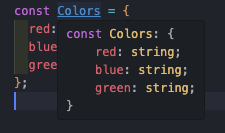

# 객체란 ?

타입스크립트의 객체는 `연관 배열` 이라고 합니다.
연관 배열이란 간단하게 `{}` 을 사용하고, `key : value` 의 값을 쌍으로 갖는 배열을 의미하고 간단하게 `객체` 라고 말해도 괜찮습니다.

```ts
const obj = {
  foo: 123,
  bar: "Hello World",
};

console.log(obj.foo); // 123
console.log(obj.bar); // "Hello World"
```

위의 예제 코드를 `{}`로 감싸는 무언가를 `객체 리터럴` 이라고 합니다.

`,` 로 구분되어있는 `key : value` 를 `프로퍼티` 라고 합니다.

아래 console.log 로 값을 얻는걸 `프로퍼티 접근` 이라고 합니다.

### 객체 리터럴 기본 구문

객체 리터럴은 식의 일종입니다.

```ts
const obj = { ... }
```

`{}` 의 값을 `obj`에 할당을 한다는거지 블록이 아니라는 점을 주의해야합니다.

```ts
const obj = {
  foo: 555,
  bar: "문자열",
};
```

bar 뒤에 `,` 가 있는데 요즘 트랜드는 마지막 요소다. 라는 식으로 알려줄 수 있게 `,` 를 넣어주는게 트렌드입니다.
하지만 요즘엔 `Prettier` 로 셋팅을 다 해놓고하기에 그렇게 크게 신경 쓰지는 않는 부분입니다.

```ts
const user = {
  name: input ? input : "이름 없음",
  age: 20,
};
```

객체에 값을 넣는 방식이지만 삼항연산자 때문에 `:` 이 두번 나와 헷갈릴 수도 있습니다.
그렇기에 미리 변수에 담아서 사용을 하는 경우가 많습니다.

```ts
const name = input ? input : "이름 없음",
const user = {
  name: name
  age: 20,
};

// shorthand property 사용
// shorthand property : key , value 의 이름이 같을때 축약해서 사용하는 방법

const name = input ? input : "이름 없음",
const user = {
  name,
  age: 20,
};
```

### 프로퍼티 접근 : 값 취득과 대입

`프로퍼티의 접근`이란 객체의 프로퍼티 값을 가져오거나 프로퍼티 값에 대입하는 기능을 말한다.

```ts
const user = {
  name: "sunyong",
  age: 30,
};

user.age = 28;
console.log(user.age); // 28
```

`.` 접근자를 사용하여 user.age에 새로운 값은 28을 할당을 해주었습니다.

### 객체 리터럴 전개 구문

객체 리터럴 안에는 `전개 구문 (spread syntax)` 라고 불리는 구문을 사용할 수 있습니다.
이 구문을 사용하면 다른 객체의 프로퍼트를 복사해 올 수있습니다. `...`으로 만들 수 있습니다.

```ts
const obj1 = {
  bar: 456,
  baz: 789,
};

const obj2 = {
  foo: 123,
  ...obj1,
};

console.log(obj2); // {foo: 123, bar: 456, baz: 789}
```

전개 구문은 기존객체를 확장해서 별도의 객체를 만드록 싶을때 많이 사용이됩니다.

전개 구문과 프로퍼티 선언이 같은 프로퍼티를 가지고 있다면 위치상 뒤에 있는걸 우선시 합니다.

```ts
const obj1 = {
  foo: 123,
  bar: 456,
  baz: 789,
};

const obj2 = {
  ...obj1,
  foo: -9999,
};

console.log(obj2); //{foo: -9999, bar: 456, baz: 789}
```

반대로 앞에 넣으시에는 에러가 나옵니다. 이유는 덮어씌어지는데 앞에 있는건 무의미하기 때문입니다.

```ts
const obj1 = {
  foo: 123,
  bar: 456,
  baz: 789,
};

const obj2 = {
  foo: -9999,
  ...obj1,
};

console.log(obj2);
```

`여러개를 사용하여 복사도 가능합니다.`

```ts
const obj1 = {
  foo: 123,
  bar: 456,
  baz: 789,
};

const obj2 = {
  fff: 123,
  ddd: 444,
};

const obj3 = {
  ...obj1,
  ...obj2,
};

console.log(obj3); // {foo: 123, bar: 456, baz: 789, fff: 123, ddd: 444}
```

### 객체는 어떤 경우에 같은가?

어떤 경우에 같은지 잘 알아야합니다. 생각보다 실수 하기 쉽고 , 이런 상황때문에 의도치 않은 실수를 할 수 있기에 정확히 알고 넘어가야할 부분입니다.

```ts
const foo = { num: 1234 };
const bar = foo;

console.log(bar.num); //1234
bar.num = 0;
console.log(foo.num); // 0
```

여기서 포인트는 foo , bar 라는 두개의 변수가 있지만 그 변수들에 들어있는 객체의 실체는 하나라는 점입니다.


같은 곳을 가르키기에 처음 값이였던 `num : 1234` 가 `bar.num = 0` 으로 바뀌어서 foo를 불러올때도 값이 0으로 바뀐것 입니다.

이런 경우처럼 의도치 않게 객체가 변경되기도 하는데 이를 `명시적으로 복사하지 않으면 같다` 라고 표현을 합니다.
그럼 해결을 어떻게해야 할까 라고 생각이 들텐데, 원칙은 별도의 객체를 얻기 위해선 객체를 별도로 만드렁야합니다.
객체 구문은 객체 리터럴 안에서 사용할 수 있는 구문이고 객체 리터럴은 새로운 객체를 만드는 구문으로 확실히 객체가 복사되는 셈이다.

```ts
const foo = { num: 1234 };
const bar = { ...foo };

console.log(bar.num); //1234
bar.num = 0;
console.log(foo.num); // 1234
```

이 경우는 첫번째 예시와는 다르게 객체와 별도의 객체이기에 `bar.num = 0` 을 넣더라도 foo는 변하지 않는다는 것 입니다.



하지만 꼭 전개 구문을 사용할 필요는 없고 하드 코딩해서 사용하는 경우도 있지만 , 전개 구문을 사용할 경우 헷갈릴 수 있으니 하드코딩하는것이 더 바람직할 경우도 있습니다.

중첩된 객체도 포함해서 모두 복사하고 싶을 때 쓰는 표준방법은 아직 존재하지 않습니다. 전개 기법으로 중복된 객체를 사용하는거솓 방법이지만 코드가 길어진다는 아쉬운점이 있습니다. 이때 라이브러리르 많이 사용합니다.

```ts
const foo = { num: 1234 };
const bar = foo;
const baz = { num: 1234 };

console.log(foo === bar); // true
console.log(foo === baz); // false
```

내용물이 같다 한들 별도의 객체는 비교하면 false가 됩니다. 객체 자체가 같은지 가 아니라 내용물이 일치하는지를 비교하고 싶은 경우도 많지만 이럴 때 사용하는 방법은 아직 없다.
