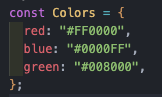
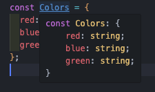
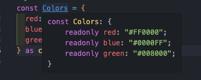

# as에 의한 타입 단원

타입 단언에 대해서 설명하겠습니다.

앞서 타입 단언은 가능한 사용을 피해야합니다. 이유는 타입 단언은 타입 스크립트가 보증하는 타입 안전성을 의도적으로 파괴하는 기능입니다.

근데 왜 존재하는 걸까요 ?? 이유는 `타입스크립트의 타입 추론이 완벽하지 않다` 라는 이유입니다.

이를 보충하기 위해 때때로 타입 단언을 사용 할 수 있습니다.

## 타입 단언을 이용해서 식의 타입 속이기

타입 단언의 구문은 `as 타입` 형태이고 , 식의 타입을 강제적으로 바꾸는 의미입니다.

타입 단언에서는 실제 값에는 아무 일도 일어나지 않고 타입스크립트 컴파일러가 인식하는 타입만 변화하게 됩니다.
타입스크립트에서 제일 복잡한 부분이 바로 값 과 타입의 구별입니다. 확실히 이해하고 넘어가야합니다.

```ts
// 잘못된 예
function getFirstFiveLetters(strOrNum: string | number) {
  const str = strOrNum as string;
  return str.slice(0, 5);
}

console.log(getFirstFiveLetters("jeonsunyong")); // jeons
console.log(getFirstFiveLetters(123)); // Error
```

원래라면 함수 getFirstFiveLetters 는 인수가 string | number 로 유니온 타입이였습니다. 하지만 as 를 사용하여 타입단언을 사용하였고 그로인해 string 타입만 가능합니다.

하지만 `strOrNum as string;` 은 컴파일러상 타입을 강제로 변화시키는 구문이고 실제로 값은 아무것도 바뀌지 않습니다.
즉, strOrNum 에 숫자값이 들어 있다면 변수 str에 들어있는 것도 그대로 숫자값일 것입니다.

as 는 이처럼 타입스크립트의 판단을 강제로 뒤엎기 위한 기능이고 잘못 사용하면 타입 안전성을 파괴하는 결과로 이루어 집니다.
그 결과 잘못된 결론을 네게 되기도 하며 잘못된 정보로 인해 타입스크립트의 이점을 희미하게 하기에 as의 사용을 최대한 피해야합니다.

```ts
// 올바른 사용법
type Animal = {
  tag: "animal";
  species: string;
};

type Human = {
  tag: "human";
  name: string;
};

type User = Animal | Human;

function getNamesIfAllHuman(users: readonly User[]): string[] | undefined {
  if (user.every((user) => user.tag === "human")) {
    // Error : Property name does not exist on type User
    // Error : Property name does not exist on type Animal

    return user.map((user) => user.name);
  }
  return undefined;
}
```

getNamesIfAllHuman의 목적은 주어진 User의 배열이 모두 Human이라면 그 name을 모은 배열을 반환하는 것입니다. 그리고 만약 Animal이 포함돼 있다면 undefined를 반환합니다.

이를 위해 사용한 메서드가 `every` 입니다. 전달받은 콜백 함수를 자신의 각 요소마다 호출한 뒤 모든 결과가 true면 true를 그렇지 않다면 false를 반환합니다.
따라서 users의 모든 요소가 user.tag === 'human' 이라는 조건을 만족하는지 확인합니다.
그러므로 if 문 안에 users의 요소는 모두 Human일 것입니다.

```ts
// 비교적 쉬운 올바른 사용법
function getNamesIfAllHuman(users: readonly User[]): string[] | undefined {
  if (user.every((user) => user.tag === "human")) {

    return (users as Human[]).map(user => user.name)
  return undefined;
}
```

여기서도 타입단언으로 인한 방법은 위험합니다. 근데 왜 올바른 사용법일까요 ?

바로 `부정확한 타입을 올바르게 고치기 위해서 사용` 하였기 때문입니다.

User[]도 틀린 것은 아니지만 users.every로 내용물이 모두 Human임을 검사했으므로 Human[] 쪽이 더욱 정확합니다.

이처럼 타입 단언은 제한적으로 사용해야합니다. 자주 사용하게 되면 올바른 타입이 잘못된 타입으로 되어 타입 안전성을 파괴하거나 렌터임 에러로 이어지기 때문입니다.

## as const의 사용법

이 기능은 조금 더 성장하면 빈번하게 사용이 됩니다.

구문은 `식 as const`이고 지금까지 설명한 타입 단언의 as 타입 구문에서 타입 부분이 const로 바뀌었다고 생각하면 됩니다.

이 기능은 as 타입 처럼 위험하지 않습니다. 오히려 잘 사용하면 안전성을 향상시킬 수 있습니다.

이 기능은 식 as const에서 식 부분의 타입 추론에 대해 다음과 같이 네 가지 효과를 발휘합니다.

- 베열 리터럴의 타입 추론 결과를 배열 타입이 아니라 튜플 타입으로 만든다.
- 객체 리터럴로부터 추론되는 객체 타입은 모든 프로퍼티가 readonly가 된다. 배열 리터럴로부터 추론되는 튜플 타입도 readonly 튜플 타입이 된다.
- 문자열 , 숫자 , BigInt, 불리언 리터럴에 붙여지는 리터럴 타입이 넓혀지지 않는 리터럴 타입이 된다.
- 템플릿 문자열 리터럴의 타입이 string이 아니라 템플릿 리터럴 타입이 된다.

  이 중 3번째가 가장 유용합니다.

  ```ts
  // string[] 타입
  const names1 = ["sy", "jr", "dj"];

  // readonly ['sy', 'jr', 'dj'] 타입
  const names2 = ["sy", "jr", "dj"] as const;
  ```

두 배열은 모두 동일하게 3개의 요소를 갖지만 names1과 names2의 타입은 as const를 붙이는지에 따라 달라집니다.

정말 간단하게 설명하자면 as const를 사용하면 추론이아닌 리터럴 타입으로 변한다 라는 의미입니다.




보면 Colors 라는 객체에 타입 추론을 통해 각자 string이라는 타입을 반환하고 있습니다.

그리고 as const를 사용하면



이처럼 리터럴 타입으로 바뀌고 readonly가 됩니다.
