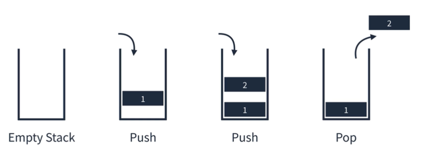
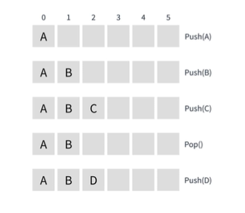
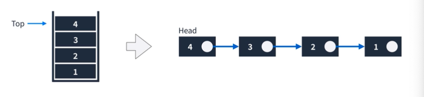

# 스택

## Last In First Out (LIFO)

Last In First Out 개념을 가진 선형 자료구조

나중에 들어간 요소가 먼저 나오고, 먼저들어간 요소가 나중에 나온다.

상자라고 생각하면 편하다.

사용 메서드 : `push` , `pop`

### 이미지로 확인하기



### 배열로 확인하기



배열의 단점인 중간요소 추가, 삭제 로직이 사용되지 않기에 유리한 방식이다.

### 연결리스트로 확인하기



### JavaScript로 확인하기

`Array로 구현`

```js
const stack = [];

// push
stack.push(1);
stack.push(2);
stack.push(3);
stack.push(4);
console.log(stack); // [1,2,3,4]

// pop

stack.pop();
console.log(stack); // [1,2,3]
```

`연결리스트로 구현`

```js
class Node {
  constructor(value) {
    this.value = value;
    this.next = null;
  }
}

class Stack {
  constructor() {
    this.top = null;
    this.size = 0;
  }

  push(value) {
    const node = new Node(value);
    node.next = this.top;
    this.top = node;
    this.size += 1;
  }

  pop() {
    const value = this.top.value;
    this.top = this.top.next;
    this.size -= 1;
    return value;
  }

  size() {
    return this.size;
  }
}

const stack = new Stack();
stack.push(1);
stack.push(2);
stack.push(3);
stack.push(4);
console.log(stack.pop()); // 4
stack.push(5);
console.log(stack.pop()); // 5
console.log(stack.pop()); // 3
```
