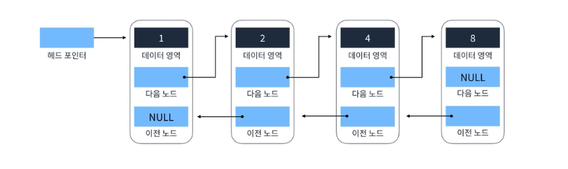
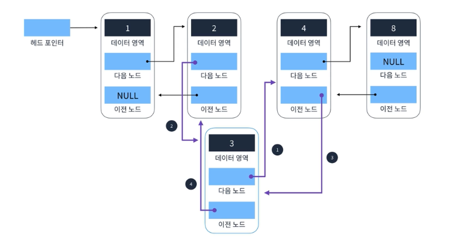
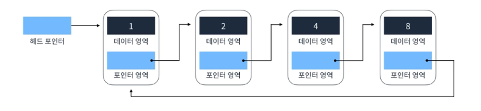

# 연결리스트

`상수시간` : 가장 효율적인 문제 해결 시간
`선형시간` : 비효율적인 문제 해결 시간

각 요소를 포인터로 연결하여 관리하는 선형 자료구조이다.

각 요소는 노드라고 부르고, 데이터 영역과 포인터 영역으로 구성된다.

`Head` 라고 불리는 첫번째 노드, 각 알파벳을 데이터 영역 즉 해당 노드의 값 이라고 하고,
화살표는 다음 영역을 가르키는것이 특징

### 연결리스트의 특징

- 메모리가 허용하는 한 요소를 제한없이 추가 가능
- 배열과 정반대라고도 해도된다.
- 연결리스트의 구현은 3가지
  - Singly Linked List
  - Doubly Linked List
  - Circular Linked List

## 배열과의 차이점

`메모리 차이`

### 배열의 요소 추가 삭제

`배열 요소 삭제`

`배열 요소 추가`
배열은 요소를 추가하려면 요소를 한단계씩 뒤로 밀어야 한다.

### 연결리스트 요소 추가 삭제

`연결리스트 요소 삭제`

삭제할 요소를 고르고, 이전 요소가 가르키는 포인터를 다음 포인터로만 연결하면 끝

`연결리스트 요소 추가`

추가할 부분의 다음요소를 포인터로 지정, 끼어놓은 영역을 이전 영역을 포인터로 지정

## Singly Linked List (단일 연결 리스트)

가장 기본적이로 단순한 연결 리스트
`Head` 는 가장 앞 영역, `Tail` 은 가장 끝 영역

### 단일 연결리스트의 핵심로직

- 요소 찾기
  - 순차적으로 이동하면서 찾을 데이터에서 결과값을 반환하면 된다.
  - 
- 요소 추가
  - 
- 요소 삭제
  - 

### Doubly Linked List (이중 연결 리스트)

포인터가 하나 추가가되어 양방향으로 이어지는 연결 리스트
포인터 변수가 추가되었기에 단일연결 리스트가 데이터가 조금 더 크다.

- 요소 추가
  - 
- 요소 삭제
  - 

### Circular Linked List (선형 연결 리스트)

한가지를 제외하면 이중 , 단일과 똑같아서 로직이 다르지 않다.

다른점 : Tail -> head 를 이어지게 하고 있다 라는 점.

