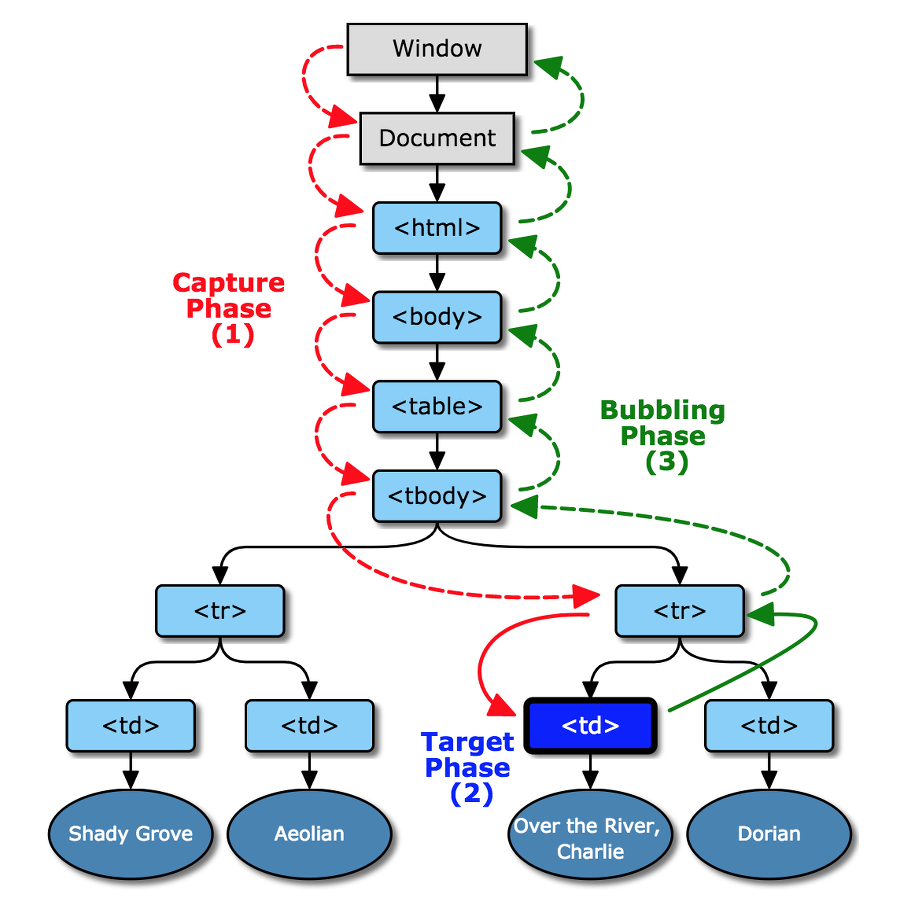

# DOM (Documnet Object Model)

- DOM(문서 객체 모델) 은 메모리에 웹 페이지 문서 구조를 트리구조로 표현해서 웹 브라우저가 HTML 페이지를 인식하게 해줍니다.
- 웹 페이지를 이루는 요소들을 자바스크립트가 이용할 수 있게끔 브라우저가 트리구조라 만든 객체 모델을 의미한다.

- 트리의 각 요소들을 노드 라고 한다.

## DOM 조작

- DOM 트리를 DOM에서 제공해주는 API를 이용해서 조작할 수 있다.
- API 를 이용해서 DOM 구조에 접근하거나 원하는 요소(Element)를 수정하거나 없애거나 할 수 있다.

## DOM 탐색하기

- 자식 노드 : 바로 아래의 자식 요소를 나타낸다
- 후손 노드 : 중첩 관계에 있는 모든 요소를 의미, 자식 노드와 그 보다 자식 노드 모두가 후손 노드가 된다.
- 모든 노드에 적용 가능한 탐색 프로퍼티
  - parentNode, childNodes, firstChild, lastChild, previousSibling, nextSibling
- 요소 노드에만 적용 가능한 탐색 프로퍼티
  - parentElement, children, firstElementChild, lastElementChild, previousElementSibling, nextElementSibling

## DOM 컬렉션

- childNodes 마치 배열 같아 보이지만 childNodes는 배열이 아닌 반복 가능한(iterable) 유사 배열 객첵인 컬렉션
  

- childNodes 가 컬렉션이기에 가능한 특징
  - `for .. of` 사용 가능 (`for .. in` 은 사용 불가) 비록 배열은 아니지만 `forEach(), for..of` 도 사용 가능
    - for of => 배열 순환할 때 사용
    - for in => 객체 순환할 때 사용
  - 배열이 아니기에 배열 메소드 사용 불가

## 요소 생성하기

- document.createElement(tagName)
  - createElement 메서드에 태그 이름을 넣어서 요소 생성

## 요소 삭제, 교체

- parentNode.removeChild(node)

  - 하나의 노드를 삭제
  - 삭제할 때는 삭제할 노드를 자식으로 가진 부모 노드에서 실행

- parentNode.replaceChild(newChild, oldChild)
  - 원래 있는 Child 삭제 후 새 Child로 교체
  - 교체할 때는 교체할 노드를 자식으로 가진 부모 노드에서 실행

## DOM Event

- Event Listener
  - 이벤트가 발생했을 때 어떠한 액션을 위한 함수의 호출을 `이벤트 리스너` 라고 한다.

## Event Bubbling

- 이벤트 버블링이란 가장 깊게 중첩된 요소에 이벤트가 발생 했을 때 이벤트가 위로 전달되는것을 의미
  - 맨 아래에서 실행되면 아래에서 위로 간다.
    
    
- 코드에서는 p , div , form 순으로 alert가 나온다.

## Event Capturing

- 이벤트 캡쳐링이란 이벤트 버빌링과는 다르게 제일 상단에 있는 요소에서 아래로 이벤트가 내려오는 것을 의미한다.

### 이벤트의 3단계 흐름

1. 캡쳐링 단계 - 이벤트가 하위 요소로 전파하는 단계
2. 타깃 단계 - 이벤트가 실제 타깃 요소에 전달되는 단계
3. 버블링 단계 - 이벤트가 상위 요소로 전파되는 단계

