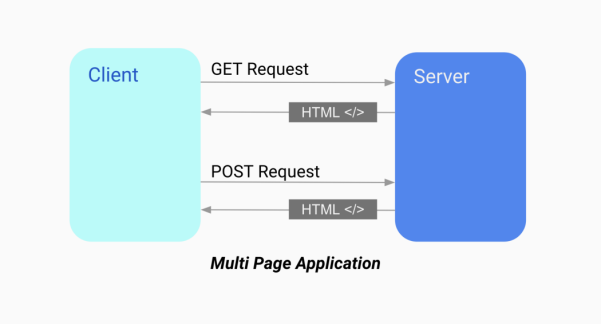

# SPA, CSR

### 서론

과거 리액트 애플리케이션을 만들땐 Create React App (CRA) 를 많이 사용했지만 요즘은 Surver Side Rendering(SSR) 을 지원하는 next.js 같은 프레임워크를 사용해 프로젝트를 만드는게 큰 인기를 끌고있다.

SSR 과의 반대 개념인 CSR, Single Page Application(SPA) 에 대해서 먼저 알아보자.

## Clinet Side Rendering (CSR)

클라이언트 측에서 페이지 렌더링이 이루어지는 웹 애플리케이션 구조를 나타낸다.

초기 로딩에 필요한 HTML, CSS, JavaScript 자원을 미리 다운로드 하고 이후에 사용자와의 상호작용에 따라 필요한 부분만 동적으로 업데이트 하는 방법

### 주요 특징

- 초기 로딩 속도 향상
  - 한번에 모든 리소스를 클라이언트에 다운로드 하기에 사용자가 페이지를 방문할 때 빠른 초기 로딩 속도 제공
- 부드러운 사용자 경험
  - 페이지 간의 전환이 발생할 때 서버가 아닌 클라이언트 측에서 동적으로 업데이트 함으로 페이지 간의 전환이 부드럽게 이루어짐
- SPA
  - CSR 은 주로 SPA를 구현하기 위해 사용
  - SPA는 단일 HTML 페이지로 시작, 이후에는 필요한 부분만 동적으로 업데이트하여 사용자와 상호작용
- 검색 엔진 최적화 (SEO) 고려
  - CSR은 초기 로딩 시에 검색 엔진이 크롤링할 수 있는 완전한 HTML을 제공하지 않기에 검색 엔진 최적화에 대한 고려 필요
  - 이를 해결하기 위해 SSR 사용을 생각해봐야함

### 장점

- 빠른 초기 로딩속도
- 부드러운 사용자의 경험
- 효율적인 자원 관리

### 단점

- 검색 엔진 최적화 어려움
- 초기 로딩 이후 동적 생성
- 초기 로딩 대역폭
  - 모바일 환경에서 이 점이 중요한 고려사항이 된다.
- 클라이언트 의존성
  - 클라이언트 측에서 페이지를 렌더링 하므로 , 클라이언트가 JavaScript를 지원하지 않는 경우 혹은 비활성화의 경우에는 애플리케이션이 작동 못할수도 있음

## Single Page Application(SPA)

- 렌더링과 라우팅에 필요한 대부분의 기능을 서버가 아닌 브라우저의 페이지 전환을 위한 모든 작업이 자바스크립트와 브라우저로 이루어져 있기 때문에 페이지를 불러온 이후에는 서버에서 HTML을 내려받지 않고 하나의 페이지에서 모든 작업을 처리하므로 `SPA` 라고 부릅니다.
- 최초의 서버에서 최소한의 데이터를 불러온 이후부터 이미 가지고 있는 자바스크립트 리소스와 브라우저 API 기반으로 모든 작동이 이뤄집니다.
- 최초에 로딩해야 할 자바스크립트 **리소스가 커지는 단점(번들사이즈가 크다.)** 이 있지만 한번 로딩된 이후에는 서버를 거쳐 필요한 리소스를 받아올 일이 적어지기 때문에 사용자에게 좋은 UX/UI 를 제공하는 장점이 있다.


CSR / SPA

### 정리

1. 단일 HTML 페이지

   1. SPA는 초기 로딩시 하나의 HTML 페이지만 로드하며 그 이후에는 페이지 간 전환시에 필요한 데이터와 리소스를 동적으로 로딩
   2. 사용자가 애플리케이션을 사용하는 동안 새로운 페이지를 요청할 때마다 서버에서 전체 페이지를 로드하는 것이 아니라 필요한 부분만 업데이트 가능
   3. 루트 컨테이너

      1. SPA는 주로 하나의 루트 컨테이너를 가지고 안에서 동적으로 콘텐츠를 교체
         이곳에서 동적으로 변경되는 컴포넌트나 페이지 마운트 실행

      ```jsx
      <div id="root"></div> // WONT Index.html 코드
      ```

2. 클라이언트 측 렌더링

   1. SPA === CSR 이다.
   2. 처음 필요한 HTML , CSS , JavaScript 등 을 다운로드 하고 , 이후의 페이지 갱신은 클라이언트에서 처리
   3. 사용자 경험을 향상시키고 빠르게 페이지 전환이 가능

3. 라우팅
   1. URL 변경에 따라 적절한 컴포넌트나 페이지를 렌더링하고 화면을 갱신하는 역할
   2. 클라이언트 측에서 이뤄지는 라우팅을 통해 사용자가 페이지를 이동할 때 서버에 요청을 보내지 않고도 빠르게 화면 갱신 가능
4. 비동기 통신

   1. 사용자의 경험을 향상시키기 위해 비동기 통신이 주로 사용
   2. Ajax , Fetch API를 이용하여 필요한 데이터만 서버에서 받아와 동적으로 페이지 업데이트 가능

5. 대표적인 SPA
   1. 라이브러리 : React, Angular, Vue
   2. 페이지 : Naver, Gmail
