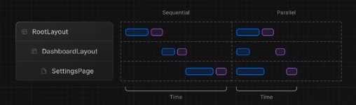
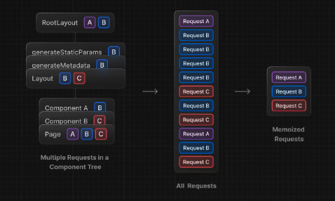
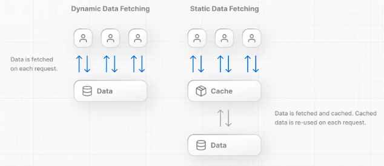

# Data fetching

`Data fetching(데이터 가져오기)` 은 모든 애플리케이션의 핵심입니다.

## fetch() API

새 데이터 가져오기 시스템은 기본 웹 API `fetch()` 위에 구축되어있으며, 서버 컴포넌트에서 `async` , `await`을 사용합니다.

- React는 자동 요청 중복 제거를 제공하기 위해 `fetch` 를 확장합니다.
- Next.js 는 fetch 옵션 객체를 확장하여 각 요청이 [자체 캐싱 및 재검증 규칙](https://nextjs.org/docs/app/building-your-application/data-fetching/fetching-caching-and-revalidating)을 설정 할 수 있도록 합니다.

## 서버에서 fetch 하기

가능하면 서버 컴포넌트에서 데이터를 가져오는 것이 좋습니다.

서버 컴포넌트는 항상 서버에서 데이터를 가져오고 , 아래 해당하는 일들을 할 수 있습니다.

- 백엔드 데이터 리소스에 직접 접근할 수 있다.
- 엑세스 토큰 및 API 키와 같은 민감한 정보가 클라이언트에 노출되지 않도록 방지하고 애플리케이션을 더 안전하게 유지
- 동일한 환경에서 데이터를 가져오고 렌더링
- 클라이언트에서 여러 개별 요청 대신, 단일 왕복 방식으로 여러 데이터 가져오기를 수행
- 클라이언트 - 서버 사이의 워터폴(waterfalls)를 줄인다.
- 지역에 따라 데이터 가져오기가 데이터 소스에 더 가깝게 발생할 수도 있으므로 , 대기 시간이 줄어들고 성능이 향상

### Good to know

클라이언트 사이드에서 데이터를 가져올 수 있다. `SWR` 또는 클라이언트 컴포넌트와 함께 `React Query`와 같은 라이브러리를 사용하는것이 좋다.

## 컴포넌트 레벨에서 데이터 가져오기

앱 라이터에서 레아웃 또는 페이지 및 컴포넌트 내부에서 데이터를 가져올 수 있다. 데이터 가져오기는 스트리밍 및 서스펜스와도 호완된다.

### Good to know

레이아웃은 부모 레이아웃과 하위 컴포넌트 간에 데이터를 전달할 수 없다. 라우트에서 동일한 데이터를 여러 번 요청하는 경우에도 필요한 레이아웃 안에서 직접 데이터를 가져오는 것이 좋다.
React, Next 는 동일한 데이터를 두 번 이상 가져오지 않도록 요청을 캐시하고 중복을 제거한다.

## 병렬 및 순차 데이터 가져오기

React 구성 요소 내에서 데이터를 가져올 때 병렬(Parallel) 및 순차(Sequential) 라는 두가지 데이터 가져오기 패턴을 사용할 수 있다.


- 병렬 데이터 가져오기 : 사용시 라우트의 요청이 즉시 시작되고 동시에 데이터를 로드한다. 병렬방법 사용시 클라이언트 - 서버 워터폴과 데이터를 로드하는 데 걸리는 시간이 줄어든다.
- 순차 데이터 가져오기 : 사용시 라우트의 요청이 서로 종속되어 워터폴을 생성.
  하나의 가져오기가 다른 가져오기의 결과에 의존하는 패턴이기에 리소스를 절약하기 위해 다음 fetch 전에 조건이 충족되기를 원하는 경우가 있을 수 있다.
  하지만 이 동작은 의도하지 않은 것일 수 도있으며 로드 시간이 길어질 수 있다.

## 자동 가져오기 요청 중복 제거

트리의 여러 컴포넌트에서 동일한 데이터를 가져와야하는 경우 Next는 임시 캐시에 동일한 입력이 있는 fetch 요청을 자동으로 캐시합니다.
이 과정은 렌더링 패스 중 동일한 데이터를 두 번 이상 가져오는 것을 방지한다.


예를 들어, 전체 경로에서 동일한 데이터를 사용해야하는 경우, 트리 상단에서 데이터를 fetch한 다음 구성 요소간에 중복된 내용을 전달할 필요가 없다.
대신 동일한 데이터에 대한 같은 fetch의 경우 성능에 영향을 미치지 않고 필요한 구성 요소에서만 데이터를 가져올 수 있다.

최적화는 정적 생성 중에도 적용이 된다.

```ts
async function getItem() {
  const res = await fetch("https://.../item/1");
  return res.json();
}

const item = await getItem(); // cache MISS

const item = await getItem(); // cache HIT
```

## 정적 및 동적 데이터 가져오기

데이터에는 두 가지 타입이 있다.

- 정적 데이터는 '자주 변경되지 않는 데이터' `ex) blog`
  데이터는 각 요청에 따라 가져온다.

- 동적 데이터는 '자주 변경되거나 사용자에게 특정될 수 있는 데이터' `ex) 장바구니`
  데이터를 가져온 후 캐시된다. 캐시된 데이터는 각 요쳉에 의해 재사용된다.
  

기본적으로 Next 는 정적 fetch를 자동 수행한다. 즉, 빌드 시 데이터를 가져와 캐시하고 각 요청 과정에서 재사용된다.
개발자는 정적 데이터 `캐시(cache)` , 및 `재검증(revalidated)` 방법을 제어 할 수있다.

정적 데이터를 사용하면 두 가지 이점이 있다.

- 요청 수를 최소화하여 데이터베이스의 부화를 줄인다.
- 로딩 성능 향상을 위해 데이터가 자동으로 캐시된다.

데이터가 사용자에게 개인화 되어있거나, 항상 최신 데이터를 가져와야하는 경우 동적 요청으로 설정해 캐싱하지 않고 각 요청에서 데이터를 가져올 수있다.
