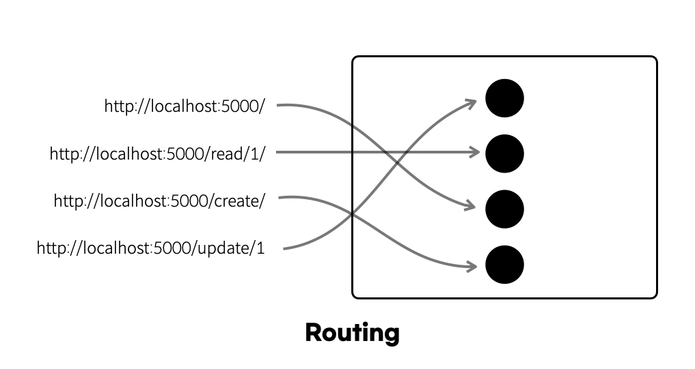

# React 에서의 React Router

## Routing ??

라우팅은 기본적으로 네트워크에서의 경로를 선택하는 프로세스를 의미한다.


## React-Router 를 사용하는 이유

Qusetion : a 태그가 있는데 굳이 라우터를 설정해줘야할 이유가있나??

Answer : SPA 사용으로 사용자의 경험 향상을 목적으로 둔다.

보통 a태그는 페이지 전체가 새로 로딩이되기에 사용자 경험을 떨어트리는 큰 원인이다.

## React - Router 이용하기

### 설치

```js
npm add react-router-dom

or

pnpm add react-router-dom

or

yarn add react-router-dom
```

### 가장 많이 사용되는 모듈 3가지

```js
import { BrowserRouter, Routes, Route } from "react-router-dom";
```

- BrowserRouter

  - history API를 활용해 history 객체를 생성
  - 브라우저 History API를 사용해 현재 위치의 URL을 저장해주는 역할이다.

- Routes

  - 자식 route들을 구성하고 있는 부모

- Route
  - path를 통해 URL을 분기시킬 수 있다. 중첩해서 사용할 수 있다. (중첩 라우팅)

### 기본설정 예시

```js
const Router = () => {
  return (
    <BrowserRouter>
      <Routes>
        <Route path="/" element={<GalleryPage />} />
        <Route path="/gallery" element={<DetailCardPage />}>
          <Route path=":cardId" element={<DetailCard />} />
        </Route>
      </Routes>
    </BrowserRouter>
  );
};
```

### Link

Link 컴포넌트는 라우터 내에서 직접적인 페이지 이동을 할 때 사용되는 컴포넌트
a태그와 비슷하다고 봐도된다. a와는 다르게 href 가 아닌 to를 사용

TMI

- Next 에서도 Link를 지원해주지만 이땐 href 사용 😃

```js
import React from "react";
import { Link } from "react-router-dom";

function Nav() {
  return (
    <div>
      <Link to="/"> Home </Link>
      <Link to="/about"> About </Link>
    </div>
  );
}

export default Nav;
```

### useNavigate

`useNavigate` 훅을 사용하면 특정 이벤트 (onClick, onChange 등) 가 발생 했을때 페이지 이동을 트리거

```js
import { useNavigate } from "react-router-dom";

const navigate = useNavigate();

const onClick = () => {
  navigate("/");
};
```

### 중첩라우팅

가장 유요항게 사용하는 기능으로, 특정 페이지 내에서 하위 페이지를 만들 수 있고 , 해당 페이지마다 경로를 이용한 데이터 전달이 가능

```js
<Route path="/about" element={<About />}>
  <Route path="location" element={<Location />}></Route>
</Route>
```
